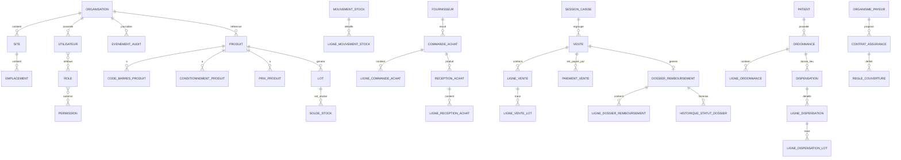

# SYSTÈME DE GESTION DE PHARMACIE — DOCUMENTATION COMPLÈTE
### Version 1.0 — Spécification Fonctionnelle, Technique & Intelligence Artificielle Embarquée
### Contexte : Cameroun | Stack : Spring Boot + PostgreSQL + Tauri/React

---

> **Comment lire ce document**
> Ce document est rédigé pour trois publics simultanément :
> - 🟢 **Novice / Pharmacien / Caissier** : compréhension terrain, scénarios vécus
> - 🔵 **Chef de projet / Manager** : workflows, règles métier, cas limites
> - 🔴 **Développeur / Architecte** : entités, règles techniques, intelligence embarquée
>
> Chaque section combine ces trois perspectives. Ne skip aucune partie : chaque détail a son importance.

---

# PARTIE 0 — VISION GLOBALE DU SYSTÈME

## 0.1 Ce qu'est ce système

Ce logiciel est le **cerveau numérique d'une pharmacie camerounaise**. Il ne se contente pas d'enregistrer des données : il observe, anticipe, alerte, et prend des décisions automatiques dans les limites autorisées.

Il gère **tout le cycle de vie** d'un médicament dans une pharmacie :

```
Fournisseur → Réception → Stock → Vente → Patient → Comptabilité → Rapports
```

Et en parallèle :
```
Ordonnance → Validation → Dispensation → Dossier Patient → Renouvellement
Assurance → Prise en charge → Dossier remboursement → Facturation organisme
Caisse → Clôture → Export comptable → Déclaration fiscale
```

## 0.2 Les deux modes de déploiement

### Mode Mono-poste
Un seul PC fait tout : serveur + base de données + interface.
Idéal pour une petite pharmacie de quartier. Tout tourne localement.

### Mode Réseau Local (LAN)
Un PC "serveur" héberge l'API et la base PostgreSQL.
Les autres postes (caisse, stock, administration) s'y connectent via le réseau local.
Aucune dépendance internet : fonctionne même si Orange ou MTN est en panne.

```
[Poste Caisse] ──┐
[Poste Stock]  ──┼──→ [Serveur Local : API Spring Boot + PostgreSQL]
[Poste Admin]  ──┘
```

## 0.3 La dimension Intelligence du système

Le système embarque une **intelligence métier** à trois niveaux :

**Niveau 1 — Surveillance continue (temps réel)**
Le système observe constamment le stock, les dates de péremption, les ventes, les alertes. Dès qu'un seuil est franchi, il agit ou alerte sans attendre qu'on lui demande.

**Niveau 2 — Anticipation (prédiction)**
En analysant l'historique des ventes (tendances, saisonnalité, rythme de consommation par produit), le système calcule automatiquement les besoins futurs et génère des suggestions de commande avant la rupture.

**Niveau 3 — Apprentissage contextuel**
Le système adapte ses seuils d'alerte, ses suggestions de commande et ses rapports en fonction du comportement réel de la pharmacie (ex : si chaque mois de décembre les ventes de paracétamol doublent, il l'intègre dans ses prévisions).

---

# PARTIE 1 — LES ACTEURS DU SYSTÈME

## 1.1 Acteurs internes (utilisateurs directs)

### 👤 L'Administrateur Système
**Qui c'est dans la vraie vie :** Le propriétaire de la pharmacie ou son représentant de confiance.

**Ce qu'il fait dans le système :**
- Crée et configure la pharmacie (nom, adresse, TVA, numéros de séquence)
- Crée tous les comptes utilisateurs et leur attribue des rôles
- Paramètre les règles métier (seuils d'alerte, taux TVA, modèles de documents)
- Consulte tous les journaux d'audit
- Lance et supervise les sauvegardes
- Installe les mises à jour
- Peut override des règles bloquantes avec justification obligatoire

**Ce qu'il ne peut PAS faire :**
- Supprimer des entrées du journal d'audit (personne ne peut)
- Modifier rétroactivement un stock sans traçabilité
- Accéder aux données d'une autre pharmacie (multisite : accès cloisonné)

**Scénario typique d'une journée :**
> Arrivée à 7h30. Consulte le tableau de bord : 3 alertes de stock bas, 1 médicament périme dans 15 jours, 1 bon de commande en attente de validation. Valide le bon de commande, ajuste un seuil d'alerte pour le paracétamol (vendu plus que prévu), crée un nouveau compte pour le stagiaire pharmacien qui commence aujourd'hui. Exporte le rapport mensuel pour le comptable.

---

### 👤 Le Pharmacien Titulaire / Responsable
**Qui c'est dans la vraie vie :** Le pharmacien diplômé, responsable légal des dispensations.

**Ce qu'il fait dans le système :**
- Valide les ordonnances scannées (lecture, clarification si illisible)
- Autorise les substitutions (générique à la place de la marque)
- Supervise les dispensations de stupéfiants et psychotropes
- Peut débloquer la vente d'un lot périmé en cas d'urgence absolue (avec motif tracé)
- Consulte les interactions médicamenteuses signalées par le système
- Valide les inventaires
- Supervise les alertes péremption et quarantaine
- Accède au dossier patient complet

**Ce qu'il ne peut PAS faire :**
- Modifier les prix (réservé à l'Administrateur)
- Clôturer la caisse (réservé au Comptable/Administrateur)
- Supprimer un utilisateur

**Scénario typique :**
> Un patient arrive avec une ordonnance pour un médicament en rupture de stock. Le pharmacien consulte le système : propose un générique disponible. Le système affiche automatiquement l'équivalence thérapeutique. Le pharmacien valide la substitution, note le motif. La dispensation est tracée avec la mention "substitution autorisée par Dr. XXX".

---

### 👤 Le Caissier / Assistant Pharmacien
**Qui c'est dans la vraie vie :** L'employé au comptoir qui sert les clients.

**Ce qu'il fait dans le système :**
- Scanne les codes-barres des médicaments pour créer une vente
- Encaisse (espèces, Mobile Money MTN/Orange, carte)
- Imprime tickets et factures
- Enregistre les ordonnances (scan) et les transmet au pharmacien pour validation
- Gère les retours simples (sans ordonnance, dans les délais autorisés)
- Consulte le stock disponible au comptoir
- Cherche un médicament par nom ou DCI si le client ne connaît pas le nom exact

**Ce qu'il ne peut PAS faire :**
- Modifier un prix
- Vendre un médicament soumis à ordonnance sans validation pharmacien
- Accéder aux dossiers patients complets (seulement les informations nécessaires à la vente)
- Voir les marges et coûts d'achat

**Scénario typique :**
> Client arrive, demande "quelque chose pour la fièvre". Le caissier tape "fièvre" dans la barre de recherche. Le système affiche les médicaments disponibles au comptoir classés par disponibilité. Client choisit le Paracétamol 500mg. Scan du code-barres. Le système sélectionne automatiquement le lot qui périme le plus tôt (FEFO). Client paie en Mobile Money MTN. Le système génère le ticket, met à jour le stock, enregistre le paiement.

---

### 👤 Le Magasinier / Gestionnaire de Stock
**Qui c'est dans la vraie vie :** L'employé responsable du stock physique, des réceptions, des inventaires.

**Ce qu'il fait dans le système :**
- Reçoit les livraisons fournisseurs : vérifie quantités, lots, péremptions, et enregistre
- Transfère les médicaments de la réserve vers le comptoir
- Réalise les inventaires physiques mensuels
- Signale les avaries, les périmés, les manquants
- Envoie les produits en quarantaine
- Consulte les alertes de stock bas générées par le système
- Prépare les retours fournisseurs

**Ce qu'il ne peut PAS faire :**
- Accéder aux données financières (prix d'achat visibles, mais pas les marges)
- Modifier une vente
- Créer un bon de commande (il peut en suggérer, l'admin valide)

**Scénario typique :**
> Le système a généré une alerte la veille : "Stock Amoxicilline 500mg < seuil minimum (50 unités restantes, consommation moyenne 30/jour → rupture dans 1.6 jours)". Le magasinier voit l'alerte sur son écran. Un bon de commande a déjà été pré-rempli automatiquement par le système. Il confirme les quantités, l'envoie à l'administrateur pour validation. Pendant ce temps, il reçoit la livraison du fournisseur LABOREX. Il vérifie : 200 boîtes de Paracétamol lot XY789, péremption 03/2027. Il scanne, enregistre. Le système met à jour le stock instantanément et retire l'alerte.

---

### 👤 Le Comptable
**Qui c'est dans la vraie vie :** Le responsable financier de la pharmacie (peut être externe).

**Ce qu'il fait dans le système :**
- Ouvre et clôture la caisse (début et fin de journée)
- Enregistre les dépenses de la pharmacie (loyer, salaires, électricité...)
- Consulte le journal de caisse
- Rapproche les paiements Mobile Money avec le système
- Exporte les données comptables (format compatible avec les logiciels comptables locaux)
- Génère les états financiers (ventes du mois, marge brute, dépenses)
- Suit les dossiers de remboursement assurance

**Ce qu'il ne peut PAS faire :**
- Modifier rétroactivement une vente
- Accéder aux dossiers médicaux patients
- Créer ou modifier des produits

---

## 1.2 Acteurs externes (interviennent indirectement)

### 👥 Le Fournisseur
**Qui c'est :** LABOREX, UBIPHARM, SODIPHARM, et les grossistes locaux.

**Comment il interagit avec le système :**
- Il reçoit des bons de commande (imprimés ou par email depuis le système)
- Ses livraisons sont enregistrées à la réception
- Ses retours/avoirs sont tracés
- Le système évalue sa fiabilité (taux de livraison, délais, qualité)

**Ce qu'il ne voit pas :** Il n'a pas accès direct au système. Tout passe par le magasinier.

---

### 👥 Le Médecin / Prescripteur
**Qui c'est :** Les médecins, infirmiers et sages-femmes qui prescrivent.

**Comment il interagit avec le système :**
- Ses ordonnances sont scannées et enregistrées
- Son profil de prescription est tracé (utile pour les interactions avec les organismes de santé)
- Le système peut identifier les ordonnances d'un même prescripteur (surveillance stupéfiants)

---

### 👥 L'Organisme d'Assurance / Mutuelle
**Qui c'est :** CNPS, mutuelles d'entreprise, assurances privées.

**Comment il interagit avec le système :**
- Les dossiers de remboursement lui sont soumis (imprimés ou export numérique)
- Ses taux de prise en charge sont paramétrés dans le système
- Ses rejets sont enregistrés et analysés

---

### 👥 L'Auditeur / Inspecteur (MINSANTÉ, DGI)
**Qui c'est :** Les inspecteurs du Ministère de la Santé, de la DGI (impôts).

**Comment il interagit avec le système :**
- Le pharmacien peut exporter un journal d'audit complet, horodaté, signé numériquement
- Les registres de stupéfiants sont exportables dans le format réglementaire
- Les inventaires sont archivés et consultables

---

### 👥 Le Patient
**Qui c'est :** La personne qui achète des médicaments.

**Comment il interagit avec le système :**
- Son dossier peut être créé (optionnel pour les ventes sans ordonnance)
- Son historique d'ordonnances et de dispensations est tracé
- Ses allergies connues sont enregistrées (le système alerte si un médicament prescrit est dans la liste)
- Il peut recevoir un reçu par SMS (si configuré)

---

# PARTIE 2 — MODULES ET SCÉNARIOS DÉTAILLÉS

---

## MODULE A — RÉFÉRENTIELS & PARAMÈTRES

### A.1 Création de la pharmacie (premier démarrage)

**Acteur :** Administrateur

**Contexte :** Première installation du logiciel. Rien n'existe encore.

**Étapes détaillées :**

**Étape 1 — Assistant de démarrage**
Au premier lancement, le système affiche un assistant guidé (wizard). Il est impossible d'utiliser le logiciel sans compléter cette configuration.

**Étape 2 — Informations de la pharmacie**
```
Nom commercial : Pharmacie de la Paix
Numéro d'autorisation d'ouverture : PH-2024-00123
Adresse : Rue 1.234, Bastos, Yaoundé
Téléphone : +237 222 22 22 22
Email : contact@pharmaciedelapaix.cm
Responsable légal : Dr. Amina FOUDA
Numéro d'ordre : 001234
```

**Étape 3 — Paramètres fiscaux**
```
Devise : XAF (Franc CFA)
Taux TVA médicaments : 0% (exonérés au Cameroun)
Taux TVA articles para-pharmaceutiques : 19.25%
Format facture : FAC-{ANNÉE}-{SÉQUENCE} → ex: FAC-2025-000001
Format ticket : TK-{ANNÉE}-{MOIS}-{SÉQUENCE}
```

> 🔴 **Note technique :** La TVA sur les médicaments au Cameroun est complexe. Les médicaments listés par le MINSANTÉ sont exonérés. Les produits para-pharmaceutiques (cosmétiques, compléments alimentaires) sont taxés à 19.25%. Le système doit permettre de configurer le profil fiscal de chaque produit.

**Étape 4 — Création des emplacements standards**
Le système propose automatiquement les emplacements standards :
- Réserve Principale
- Comptoir Médicaments
- Comptoir Para-pharmaceutique
- Chambre Froide / Frigo (si applicable)
- Local Stupéfiants (accès restreint, physiquement séparé)
- Zone Quarantaine

**Étape 5 — Paramètres d'alerte intelligente**
```
Seuil alerte stock bas : 30 jours de stock (calculé automatiquement selon historique)
Alerte péremption précoce : 90 jours avant date limite
Alerte péremption urgente : 30 jours avant date limite
Seuil minimum commande : calculé par le système (modifiable)
```

**Règles bloquantes :**
- Il est impossible de créer un compte utilisateur avant de compléter la configuration de base
- Tous les champs marqués obligatoires doivent être remplis
- Le numéro d'autorisation d'ouverture est unique et vérifié localement

---

### A.2 Paramétrage avancé — Séquences de numérotation

**Acteur :** Administrateur

Le système génère automatiquement tous les numéros de documents. L'administrateur peut personnaliser les formats.

| Document | Format par défaut | Exemple |
|----------|------------------|---------|
| Vente | VT-{AA}-{MM}-{SEQ5} | VT-25-04-00234 |
| Facture | FAC-{AAAA}-{SEQ6} | FAC-2025-000234 |
| Bon de commande | BC-{AA}-{SEQ4} | BC-25-0012 |
| Réception | REC-{AA}-{MM}-{SEQ4} | REC-25-04-0008 |
| Inventaire | INV-{AA}-{MM}-{SEQ2} | INV-25-04-01 |
| Ordonnance | ORD-{AA}-{MM}-{SEQ5} | ORD-25-04-00089 |

**Intelligence :** Les séquences se réinitialisent automatiquement (mensuel ou annuel selon configuration). Aucune séquence ne peut reculer. Aucun numéro ne peut être réutilisé.

---

## MODULE B — UTILISATEURS, RÔLES, PERMISSIONS, AUDIT

### B.1 Création d'un compte utilisateur

**Acteur :** Administrateur

**Scénario complet — Création du compte caissier "Marie BETI" :**

1. L'administrateur ouvre le module Utilisateurs
2. Clique sur "Nouveau compte"
3. Renseigne :
   - Nom : BETI
   - Prénom : Marie
   - Email : marie.beti@pharmaciedelapaix.cm
   - Téléphone : +237 690 00 00 01
   - Rôle : CAISSIER
4. Le système génère un mot de passe temporaire aléatoire et sécurisé
5. Envoie les identifiants par SMS ou les imprime
6. À la première connexion, Marie **doit** changer son mot de passe (bloquant)
7. L'audit enregistre : "Compte créé par ADMIN-001 le 27/04/2025 à 09:12"

**Règles de sécurité des mots de passe :**
- Minimum 8 caractères
- Au moins 1 majuscule, 1 chiffre, 1 caractère spécial
- Expiration automatique tous les 90 jours
- Impossibilité de réutiliser les 5 derniers mots de passe
- Blocage après 5 tentatives échouées (débloqué uniquement par l'Administrateur)

---

### B.2 Matrice des permissions par rôle

| Permission | Admin | Pharmacien | Caissier | Magasinier | Comptable |
|------------|-------|-----------|---------|-----------|----------|
| Créer produit | ✅ | ✅ | ❌ | ❌ | ❌ |
| Modifier prix | ✅ | ❌ | ❌ | ❌ | ❌ |
| Vendre | ✅ | ✅ | ✅ | ❌ | ❌ |
| Valider ordonnance | ✅ | ✅ | ❌ | ❌ | ❌ |
| Réceptionner stock | ✅ | ❌ | ❌ | ✅ | ❌ |
| Inventaire | ✅ | ✅ | ❌ | ✅ | ❌ |
| Clôture caisse | ✅ | ❌ | ❌ | ❌ | ✅ |
| Exporter comptabilité | ✅ | ❌ | ❌ | ❌ | ✅ |
| Gérer utilisateurs | ✅ | ❌ | ❌ | ❌ | ❌ |
| Voir journal audit | ✅ | ❌ | ❌ | ❌ | ❌ |
| Override lot périmé | ✅ | ✅ | ❌ | ❌ | ❌ |
| Annuler vente | ✅ | ✅ | ❌ | ❌ | ❌ |
| Voir coût d'achat | ✅ | ✅ | ❌ | ✅ | ✅ |
| Voir marge bénéficiaire | ✅ | ❌ | ❌ | ❌ | ✅ |
| Gérer sauvegardes | ✅ | ❌ | ❌ | ❌ | ❌ |

---

### B.3 Le Journal d'Audit — L'œil qui ne dort jamais

**Principe fondamental :** Toute action significative dans le système est enregistrée de façon **immuable**. Personne — y compris l'Administrateur — ne peut modifier ou supprimer une entrée du journal d'audit.

**Ce qui est enregistré automatiquement :**

```
✅ Connexion / déconnexion de chaque utilisateur
✅ Chaque vente créée, modifiée, annulée
✅ Chaque modification de prix (avec valeur avant/après)
✅ Chaque réception de stock
✅ Chaque transfert de stock
✅ Chaque ajustement d'inventaire (avec motif obligatoire)
✅ Chaque mise en quarantaine
✅ Chaque dispensation de stupéfiants (avec n° ordonnance et prescripteur)
✅ Chaque override de règle bloquante (avec motif et autorisant)
✅ Chaque création/modification/désactivation de compte utilisateur
✅ Chaque export de données
✅ Chaque sauvegarde effectuée ou échouée
✅ Chaque tentative de connexion échouée
```

**Structure d'un enregistrement d'audit :**
```json
{
  "id": "audit-2025-04-27-000234",
  "horodatage": "2025-04-27T09:15:23.456Z",
  "utilisateur": {
    "id": "usr-001",
    "nom": "BETI Marie",
    "role": "CAISSIER"
  },
  "action": "VENTE_CREEE",
  "entite": "Vente",
  "entite_id": "VT-25-04-00234",
  "details": {
    "montant_total": 3500,
    "nombre_produits": 3,
    "mode_paiement": "MOBILE_MONEY_MTN",
    "lots_utilises": ["LOT-XY789", "LOT-AB123"]
  },
  "adresse_ip": "192.168.1.12",
  "poste": "CAISSE-01",
  "motif": null
}
```

---

## MODULE C — CATALOGUE PRODUITS

### C.1 Création d'un nouveau médicament

**Acteur :** Administrateur ou Pharmacien

**Scénario — Enregistrement du "Paracétamol 500mg GIFRER" :**

**Étape 1 — Identification du produit**
```
Type : Médicament
DCI (Dénomination Commune) : Paracétamol
Nom commercial : Paracétamol 500mg GIFRER
Forme galénique : Comprimé
Dosage : 500 mg
Laboratoire : GIFRER
Pays d'origine : France
```

**Étape 2 — Classification**
```
Catégorie : Antalgiques / Antipyrétiques
Sous-catégorie : Paracétamol
Classe thérapeutique : Analgésiques non opioïdes
Nécessite ordonnance : Non
Stupéfiant / Psychotrope : Non
Produit contrôlé : Non
```

**Étape 3 — Conditionnements**
```
Conditionnement 1 : Boîte de 16 comprimés (unité de vente principale)
Conditionnement 2 : Boîte de 100 comprimés (conditionnement grossiste)
Conditionnement 3 : À l'unité (décomposition possible)
Équivalence : 1 boîte/16 = 16 comprimés
```

**Étape 4 — Codes-barres**
```
Code EAN13 boîte/16 : 3401234567890
Code EAN13 boîte/100 : 3401234567891
```

**Étape 5 — Prix**
```
Prix d'achat HT (boîte/16) : 450 XAF
Prix de vente TTC (boîte/16) : 750 XAF
Marge : 66.7% (calculée automatiquement)
TVA applicable : 0% (médicament exonéré)
```

**Étape 6 — Paramètres d'alerte intelligente**
```
Stock minimum (déclenchement alerte) : 50 boîtes
Stock de sécurité (déclenchement commande) : 100 boîtes
Quantité de commande conseillée : calculée par l'IA (voir Module J)
Délai de réapprovisionnement habituel : 3 jours (appris automatiquement)
```

**Étape 7 — Informations complémentaires**
```
Interactions médicamenteuses notables : Anticoagulants, Alcool
Contre-indications : Insuffisance hépatique
Conservation : T° ambiante, à l'abri de la lumière
Durée de vie maximale après ouverture : N/A (comprimés)
```

**Validation et publication :**
Le pharmacien valide la fiche produit. Elle est ensuite active et apparaît dans les ventes.

**Intelligence embarquée :**
Si un médicament avec la même DCI et le même dosage existe déjà dans le catalogue, le système signale le doublon potentiel et propose de créer un lien de substituabilité plutôt qu'une nouvelle fiche.

---

### C.2 Gestion des modifications de prix

**Acteur :** Administrateur uniquement

**Règle absolue :** Un prix ne se modifie JAMAIS. On crée une nouvelle ligne de prix avec une date d'effet. L'ancien prix reste dans l'historique.

**Scénario — Hausse du prix du Paracétamol :**

1. L'administrateur ouvre la fiche Paracétamol 500mg GIFRER
2. Clique sur "Modifier le prix"
3. Le système demande :
   ```
   Nouveau prix de vente : 850 XAF
   Date d'effet : 01/05/2025
   Motif (obligatoire) : Hausse fournisseur LABOREX (+8% sur facture BC-25-0023)
   ```
4. Le système crée une nouvelle ligne de prix
5. Toutes les ventes avant le 01/05 continuent à utiliser l'ancien prix
6. Le journal d'audit enregistre la modification avec tous les détails
7. Une alerte est envoyée au Pharmacien et au Comptable

**Ce que l'historique conserve :**
```
01/01/2025 → 30/04/2025 : 750 XAF (créé par Admin le 01/01/2025)
01/05/2025 → ...        : 850 XAF (créé par Admin le 27/04/2025, motif: hausse fournisseur)
```

---

## MODULE D — STOCKS & TRAÇABILITÉ

### D.1 La règle FEFO — Premier Périmé, Premier Sorti

**C'est quoi FEFO ?**
Imaginez que vous avez 3 boîtes de Paracétamol :
- Boîte A : périme en juin 2025
- Boîte B : périme en décembre 2025
- Boîte C : périme en mars 2026

Quand un client achète du Paracétamol, le système **doit** prendre la Boîte A en premier (la plus proche de sa date de péremption). C'est le FEFO. Ce n'est pas une option, c'est une règle forcée.

**Pourquoi c'est critique :**
- Évite les pertes financières (médicaments périmés = perte sèche)
- Obligation légale (traçabilité pharmaceutique)
- Protège le patient (on ne lui vend jamais quelque chose qui va périmé dans 3 jours)

**Comment le système l'applique :**
À chaque scan de code-barres en vente, le système :
1. Identifie tous les lots disponibles pour ce médicament au comptoir
2. Les trie par date de péremption (croissante)
3. Sélectionne automatiquement le lot le plus proche de sa péremption
4. Si ce lot ne couvre pas la quantité demandée, prend le lot suivant dans l'ordre

---

### D.2 Réception d'une livraison fournisseur

**Acteur :** Magasinier

**Contexte :** Le livreur de LABOREX arrive avec une commande.

**Étape 1 — Vérification préliminaire**
Le magasinier ouvre le bon de commande correspondant dans le système. Il vérifie que le livreur a les bons documents (bon de livraison, facture fournisseur).

**Étape 2 — Contrôle physique**
Pour chaque produit livré, le magasinier vérifie :
- Quantité reçue vs quantité commandée
- Numéros de lot (sur les boîtes physiques)
- Dates de péremption
- État des emballages (pas d'humidité, pas de chocs)
- Température de transport (pour produits sensibles)

**Étape 3 — Saisie dans le système**
Le système charge automatiquement les produits du bon de commande. Le magasinier saisit pour chaque ligne :
```
Produit : Paracétamol 500mg GIFRER
Qté commandée : 200 boîtes
Qté reçue : 195 boîtes (manquant de 5)
Numéro de lot : LOT-GIF-2025-789
Date de péremption : 31/03/2027
Prix de la facture : 440 XAF/boîte (au lieu de 450 — avoir fournisseur)
Emplacement de rangement : Réserve Principale
```

**Étape 4 — Anomalies détectées**
Le système détecte automatiquement :
- **Quantité manquante (5 boîtes)** → Génère automatiquement une réclamation fournisseur pré-remplie
- **Prix différent** → Alerte Administrateur/Comptable pour validation
- **Date de péremption < 6 mois** → Alerte au pharmacien : "Ce lot périme dans moins de 6 mois. Confirmer la réception ?"

**Étape 5 — Validation et mise en stock**
Si tout est conforme, le magasinier valide. Le système :
1. Crée le lot dans la base
2. Crée un mouvement de stock RECEPTION
3. Met à jour le solde de stock (Réserve Principale + 195 boîtes)
4. Génère le bon de réception numéroté
5. Associe la réception au bon de commande (statut : Reçu partiel)
6. Met à jour automatiquement l'indicateur de fiabilité du fournisseur
7. Retire les alertes de stock bas si les seuils sont maintenant respectés

**Cas particulier — Produit réfrigéré (chaîne du froid)**
Pour les insulines, vaccins, etc. :
- Le système demande la température à la réception (saisie obligatoire)
- Si la température est hors norme (>8°C pour les insulines), le produit va AUTOMATIQUEMENT en quarantaine, en attente de décision du pharmacien
- Le système génère une alerte urgente pour le pharmacien

---

### D.3 Transfert Réserve → Comptoir

**Acteur :** Magasinier

**Contexte :** La réserve est pleine mais le comptoir est vide. Il faut alimenter le comptoir.

**Scénario :**
1. Le magasinier voit l'alerte : "Comptoir — Amoxicilline 500mg : 12 boîtes restantes"
2. Il ouvre le module Transfert
3. Sélectionne : Amoxicilline 500mg
4. Le système affiche les lots disponibles en réserve, triés par FEFO
5. Le magasinier saisit : transférer 50 boîtes
6. Le système sélectionne automatiquement les lots dans l'ordre FEFO
7. Le magasinier confirme après vérification physique
8. Le système crée un mouvement TRANSFERT
9. Le stock réserve diminue de 50, le stock comptoir augmente de 50
10. L'audit est enregistré automatiquement

**Intelligence :** Le système peut suggérer automatiquement la quantité à transférer basée sur la consommation journalière moyenne du comptoir et le délai habituel entre transferts.

---

### D.4 Gestion des périmés et de la quarantaine

**Acteur :** Magasinier + Pharmacien

**Scénario — Lot périmé découvert lors de l'inventaire :**

**Détection automatique :**
Chaque nuit à minuit, le système vérifie tous les lots actifs. Si un lot vient de passer sa date de péremption :
1. Le statut du lot passe automatiquement de ACTIF à PÉRIMÉ_AUTOMATIQUE
2. Le lot est exclu du stock disponible (n'apparaît plus dans les ventes)
3. Une alerte urgente est générée : "3 lots ont périmé cette nuit — Action requise"
4. Le pharmacien et l'administrateur sont notifiés

**Traitement par le Pharmacien :**
1. Pharmacien consulte la liste des lots périmés
2. Pour chaque lot, il décide :
   - **Mise en quarantaine** (attente retour fournisseur)
   - **Destruction immédiate** (avec bon de destruction)
   - **Retour fournisseur** (si accord commercial existe)
3. Il choisit "Mise en quarantaine" pour le lot XY789
4. Le système crée un mouvement MISE_QUARANTAINE
5. Le stock disponible diminue de la quantité quarantinée
6. Le lot apparaît dans la zone Quarantaine de l'interface avec l'horodatage et le motif

**Override interdit :** Il est IMPOSSIBLE de vendre un médicament en quarantaine. Cette règle ne peut être contournée par personne, même l'Administrateur.

---

### D.5 Rappel de lot — Situation d'urgence

**Contexte :** Le fournisseur LABOREX envoie une alerte : le lot "AMOX-2025-456" d'Amoxicilline est rappelé suite à une contamination détectée.

**Acteur :** Administrateur / Pharmacien

**Étape 1 — Création du rappel**
```
Produit : Amoxicilline 500mg
Numéro de lot concerné : AMOX-2025-456
Motif du rappel : Contamination bactérienne suspectée
Source : Alerte LABOREX du 27/04/2025
Niveau de criticité : URGENT (rouge)
```

**Étape 2 — Actions automatiques immédiates**
Dès la validation :
1. Le lot AMOX-2025-456 est bloqué sur TOUS les postes immédiatement
2. Si le caissier tente de scanner ce lot, le système affiche : "⛔ VENTE IMPOSSIBLE — Lot rappelé — Contacter le pharmacien immédiatement"
3. Le système localise toutes les quantités de ce lot (réserve + comptoir + quarantaine)
4. Génère un rapport de localisation : "127 boîtes trouvées (Réserve: 102, Comptoir: 25)"

**Étape 3 — Recherche des ventes antérieures**
Le système recherche automatiquement toutes les ventes effectuées avec ce lot. Pour chaque vente :
- Nom du patient (si connu)
- Date d'achat
- Quantité vendue
- Coordonnées de contact (si disponibles)

**Étape 4 — Mise en quarantaine automatique**
Toutes les quantités restantes du lot sont transférées automatiquement en Quarantaine avec le motif "RAPPEL FOURNISSEUR".

**Étape 5 — Communication**
Le système génère une liste de patients à contacter (si leurs coordonnées sont disponibles). Le pharmacien peut envoyer des SMS d'alerte depuis l'interface.

**Étape 6 — Retour fournisseur**
Le système crée automatiquement un bon de retour fournisseur avec toutes les quantités rappelées, prêt à être imprimé.

---

### D.6 Inventaire Mensuel

**Acteur :** Magasinier + Pharmacien

**Contexte :** Fin du mois. Il faut compter physiquement tous les médicaments.

**Étape 1 — Lancement de l'inventaire**
L'administrateur crée un nouvel inventaire. Le système :
- Génère la liste de tous les produits avec leur stock théorique (selon les mouvements enregistrés)
- Génère des fiches de comptage imprimables par emplacement
- Bloque les mouvements de stock pendant l'inventaire (ou les met en "file d'attente")

**Étape 2 — Comptage physique**
Le magasinier compte physiquement chaque emplacement. Il saisit les quantités réelles dans le système.

**Étape 3 — Calcul automatique des écarts**
Le système compare automatiquement :
```
Produit              | Stock théorique | Stock réel | Écart | Valeur écart
---------------------|-----------------|------------|-------|-------------
Paracétamol 500mg   | 234 boîtes      | 230 boîtes | -4    | -3000 XAF
Amoxicilline 500mg  | 89 boîtes       | 91 boîtes  | +2    | +900 XAF (!)
Ibuprofène 400mg    | 45 boîtes       | 45 boîtes  | 0     | 0
```

**Étape 4 — Investigation des écarts**
Pour chaque écart, le pharmacien doit fournir une explication :
- **Écart négatif :** Démarque inconnue (vol), Casse non signalée, Erreur de saisie précédente
- **Écart positif :** Erreur de comptage, Retour non enregistré

**Étape 5 — Validation et ajustement**
Après validation du pharmacien, le système crée des mouvements d'ajustement pour corriger les écarts. Chaque ajustement est tracé avec le motif et l'autorisant.

**Intelligence :** Le système analyse les écarts historiques. Si un produit présente systématiquement des écarts négatifs, il génère une alerte "Risque de vol ou erreur systématique sur ce produit".

---

## MODULE E — ACHATS & FOURNISSEURS

### E.1 Création et gestion des fournisseurs

**Acteur :** Administrateur

**Fiche fournisseur complète :**
```
Raison sociale : LABOREX CAMEROUN SARL
Numéro RC : RC/YAO/2010/B/00234
Numéro contribuable : M 023456789 Q
Adresse : Zone Industrielle de Bassa, Douala
Contact commercial : M. ETOGA Pierre — 699 00 00 01
Email commandes : commandes@laborex.cm
Délai de livraison habituel : 48h (appris automatiquement)
Mode de paiement préféré : Virement bancaire 30 jours
Fiabilité : 94% (calculé automatiquement sur les 6 derniers mois)
```

**Indicateur de fiabilité fournisseur (calculé automatiquement) :**
```
Taux de livraison complète : 87% (13% de livraisons partielles)
Respect des délais : 95%
Conformité des lots : 99% (1% de réclamations)
Score global : 94/100 — ✅ Fournisseur fiable
```

---

### E.2 Création d'un bon de commande

**Acteur :** Administrateur (ou Magasinier pour suggestion, Admin valide)

**Scénario 1 — Commande manuelle :**
1. L'administrateur ouvre le module Achats
2. Choisit le fournisseur LABOREX
3. Ajoute les produits ligne par ligne
4. Pour chaque produit, le système affiche :
   - Stock actuel
   - Consommation moyenne journalière
   - Jours de stock restants (calculé)
   - Quantité suggérée par l'IA
5. L'administrateur peut accepter les suggestions ou les modifier
6. Valide le bon de commande
7. Le système génère le bon en PDF, prêt à envoyer

**Scénario 2 — Commande générée automatiquement par l'IA :**
L'IA surveille en continu. Quand plusieurs produits atteignent leur seuil de commande en même temps, elle génère automatiquement un brouillon de bon de commande pour le fournisseur principal, et notifie l'administrateur : "Un bon de commande automatique a été préparé pour LABOREX (14 références en rupture imminente) — Vérifier et valider."

---

### E.3 Gestion d'une réception partielle

**Scénario :**
Commande de 200 boîtes de Paracétamol à LABOREX.
Livraison 1 (jour J) : 120 boîtes reçues.
Livraison 2 (jour J+2) : 80 boîtes reçues.

**Traitement :**
- Réception 1 : le système met à jour le stock (+120) et marque le bon de commande "Reçu partiel (60%)"
- Réception 2 : le système met à jour le stock (+80) et marque le bon de commande "Reçu complet (100%)"
- Si la 2e livraison n'arrive pas dans les délais convenus, alerte automatique à l'administrateur avec suggestion de relance fournisseur

---

### E.4 Retour fournisseur

**Acteur :** Magasinier + Administrateur

**Cas déclencheurs :**
- Produit périmé à la réception
- Lot rappelé par le fabricant
- Défaut de conditionnement constaté
- Surdosage livré par rapport à la commande

**Scénario :**
1. Le magasinier signale 10 boîtes de médicament X reçues avec un emballage endommagé
2. Il crée un retour fournisseur dans le système
3. Le système crée un mouvement de stock RETOUR_FOURNISSEUR (sortie du stock)
4. Génère un bon de retour en PDF avec les détails du lot
5. L'administrateur valide et envoie au fournisseur
6. Le système suit le statut de l'avoir fournisseur attendu

---

## MODULE F — CAISSE / VENTES (POS)

### F.1 Ouverture de la caisse

**Acteur :** Caissier ou Comptable

**Chaque matin, avant toute vente :**
1. Le caissier s'authentifie
2. Ouvre sa session caisse
3. Saisit le fond de caisse de départ (ex : 50 000 XAF)
4. Le système crée une SessionCaisse avec :
   - Heure d'ouverture
   - Caissier responsable
   - Montant initial
5. Toutes les ventes de la journée seront attachées à cette session

**Règle :** Il ne peut y avoir qu'une seule session caisse ouverte à la fois par poste.

---

### F.2 Vente simple — Sans ordonnance

**Acteur :** Caissier

**Scénario complet — Client achète du Paracétamol et de la Vitamine C :**

**Étape 1 — Création de la vente**
La caissière Marie clique sur "Nouvelle vente". Un écran de saisie s'ouvre.

**Étape 2 — Saisie des produits**
*Méthode A — Scan code-barres :*
Marie scanne la boîte de Paracétamol. Le système :
- Identifie le produit immédiatement
- Sélectionne automatiquement le lot FEFO
- Affiche : "Paracétamol 500mg GIFRER — 750 XAF"
- Ajoute à la vente

*Méthode B — Recherche par nom :*
Marie tape "vit c" dans la barre de recherche. Le système affiche instantanément tous les produits correspondants avec disponibilité. Elle choisit "Vitamine C 500mg GIFRER".

**Étape 3 — Récapitulatif**
```
Paracétamol 500mg GIFRER x1    750 XAF
Vitamine C 500mg GIFRER  x2  1 400 XAF
                         ─────────────
TOTAL TTC                    2 150 XAF
```

**Étape 4 — Paiement**
Le client paie 2 200 XAF en espèces. Marie saisit 2 200. Le système calcule : rendu monnaie = 50 XAF.

**Étape 5 — Clôture de la vente**
Marie clique "Valider". Le système :
1. Finalise la vente (numéro VT-25-04-00234)
2. Déduit les lots du stock (FEFO appliqué)
3. Enregistre le paiement
4. Imprime le ticket
5. Enregistre dans la session caisse
6. Met à jour les statistiques en temps réel

**Ticket imprimé :**
```
============================================
         PHARMACIE DE LA PAIX
         Rue 1.234, Bastos, Yaoundé
         Tél: 222 22 22 22
============================================
Date : 27/04/2025    Heure : 10:23
Caissier : Marie B.  Ticket : TK-25-04-00234
--------------------------------------------
Paracétamol 500mg GIFRER    x1    750 XAF
Vitamine C 500mg GIFRER     x2  1 400 XAF
--------------------------------------------
TOTAL                           2 150 XAF
Espèces reçues                  2 200 XAF
Monnaie rendue                     50 XAF
--------------------------------------------
Merci de votre confiance !
Conservez ce ticket pour tout retour.
============================================
```

---

### F.3 Vente avec ordonnance

**Acteur :** Caissier + Pharmacien

**Scénario — Patient avec ordonnance pour Amoxicilline :**

**Étape 1 — Enregistrement patient**
Si le patient est nouveau, le caissier crée un profil minimal :
```
Nom : TCHAMBA Paul
Prénom : Jean
Téléphone : 677 00 00 02
Allergies connues : aucune (déclaré par le patient)
```

**Étape 2 — Scan de l'ordonnance**
Le caissier scanne l'ordonnance avec le scanner de documents. L'image est attachée au dossier.

**Étape 3 — Saisie de l'ordonnance**
```
Prescripteur : Dr. MBARGA Sylvie — Hôpital Central Yaoundé
Date de prescription : 26/04/2025
Validité : 30 jours

Produit prescrit : Amoxicilline 500mg
Posologie : 3 fois/jour
Durée : 7 jours
Quantité : 1 boîte (21 comprimés)
```

**Étape 4 — Vérification automatique du système**
Le système vérifie automatiquement :
- ✅ Ordonnance dans la validité (< 30 jours)
- ✅ Produit disponible en stock
- ⚠️ Alerte allergie : "Vérifier avec le patient : Amoxicilline est une pénicilline. Allergie aux pénicillines ?"
- ✅ Prescripteur connu dans le système

**Étape 5 — Validation par le Pharmacien**
Pour les médicaments nécessitant ordonnance, le caissier ne peut pas valider seul. Le système envoie une notification au pharmacien. Celui-ci :
- Consulte la photo de l'ordonnance sur son écran
- Vérifie la posologie
- Confirme la dispensation ou la refuse avec motif

**Étape 6 — Dispensation**
Après validation du pharmacien, la vente est finalisée. La dispensation est enregistrée avec :
- Lien vers l'ordonnance
- Nom du pharmacien validant
- Lot utilisé
- Quantité dispensée

---

### F.4 Vente en mode Tiers Payant (Assurance/Mutuelle)

**Acteur :** Caissier + Pharmacien

**Scénario — Employé de la CNPS avec couverture :**

**Étape 1 — Identification de l'adhérent**
Le client présente sa carte d'assurance CNPS. Le caissier saisit le numéro d'adhérent.
Le système charge automatiquement :
```
Adhérent : FOUDA Amina — N° 00456789
Organisme : CNPS
Contrat : Couverture Maladie Standard
Taux de prise en charge médicaments : 80%
Plafond annuel : 500 000 XAF
Consommé annuel à ce jour : 125 000 XAF
Solde disponible : 375 000 XAF
Statut : ✅ Actif et valide
```

**Étape 2 — Calcul automatique**
Pour l'Amoxicilline 500mg — Prix : 2 500 XAF :
```
Prix total                    : 2 500 XAF
Prise en charge CNPS (80%)   : 2 000 XAF
Reste à charge patient (20%) :   500 XAF
```

**Étape 3 — Paiement**
- Patient paie 500 XAF en espèces (reste à charge)
- La CNPS paie 2 000 XAF (facturation différée)

**Étape 4 — Dossier de remboursement**
Le système crée automatiquement un dossier de remboursement CNPS avec :
- Ordonnance scannée
- Identité de l'adhérent
- Médicaments dispensés avec codes
- Montants
- Lot utilisé (traçabilité)

**Étape 5 — Suivi et facturation**
À la fin du mois, le comptable génère la facture de regroupement pour la CNPS. Le système génère automatiquement le bordereau de télétransmission dans le format requis.

---

### F.5 Remise et réductions

**Règles des remises :**

| Type de remise | Qui peut appliquer | Plafond | Motif obligatoire |
|---------------|-------------------|---------|-------------------|
| Remise fidélité (≤5%) | Caissier | 5% | Non |
| Remise promotionnelle (≤15%) | Pharmacien | 15% | Oui |
| Remise exceptionnelle (>15%) | Administrateur | Illimité | Oui + audit |
| Arrondi caissier | Caissier | 50 XAF | Non |

**Toute remise exceptionnelle (>15%) est enregistrée dans le journal d'audit avec :**
- Montant de la remise accordée
- Valeur commerciale "offerte"
- Justification
- Identité de celui qui l'a accordée

---

### F.6 Annulation et retour de vente

**Acteur :** Pharmacien ou Administrateur (le caissier seul ne peut pas)

**Scénario — Client revient pour rendre un médicament :**

**Conditions de retour acceptables :**
- Médicament non ouvert
- Retour dans les 72 heures
- Ticket de caisse fourni
- Médicament non soumis à ordonnance (les médicaments prescrits peuvent être retournés en cas d'erreur de dispensation uniquement)
- Vérification visuelle : emballage intact, non périmé

**Procédure :**
1. Le pharmacien ouvre la vente d'origine (par numéro de ticket ou recherche)
2. Sélectionne les articles à retourner
3. Saisit le motif obligatoire : "Client change d'avis", "Erreur de dispensation", "Médicament remplacé par médecin", etc.
4. Le système crée des **écritures inverses** : le stock est réintégré au même lot, le paiement est annulé (remboursement ou avoir)
5. L'audit enregistre l'annulation complète
6. Le ticket de retour est imprimé

**Ce qui ne peut pas être retourné :**
- Médicaments réfrigérés (rupture de chaîne du froid inconnue)
- Stupéfiants et psychotropes
- Produits déjà ouverts ou entamés
- Médicaments périmés

---

### F.7 Modes de paiement supportés

| Mode | Fonctionnement dans le système |
|------|-------------------------------|
| Espèces | Saisie du montant, calcul automatique de la monnaie |
| Mobile Money MTN | Saisie du numéro, confirmation manuelle ou API (si disponible) |
| Mobile Money Orange | Idem |
| Virement bancaire | Référence virement saisie, paiement confirmé par comptable |
| Chèque | Numéro, banque, date saisis — validé par comptable |
| Tiers payant assurance | Partie prise en charge enregistrée comme créance |
| Avoir/Crédit client | Utilisation du solde crédit du client |

**Paiement mixte :** Un client peut payer en partie en espèces et en partie en Mobile Money. Le système gère plusieurs lignes de paiement pour une même vente.

---

## MODULE G — ORDONNANCES & DOSSIER PATIENT

### G.1 Création du dossier patient

**Acteur :** Caissier (saisie basique) ou Pharmacien (saisie complète)

**Informations enregistrées :**
```
IDENTITÉ
Nom : KAMGA
Prénom : Rodrigue
Date de naissance : 15/03/1985
Sexe : Masculin
Téléphone : 677 00 00 03
Adresse : Omnisport, Yaoundé

INFORMATIONS MÉDICALES
Allergies connues : Pénicillines (réaction sévère documentée)
Pathologies chroniques : Hypertension artérielle, Diabète type 2
Médecin traitant habituel : Dr. FOKO — Polyclinique du Biyem-Assi

ASSURANCE
Organisme : CNPS
Numéro adhérent : 00789123
Taux couverture : 80%
```

**Protection des données :**
- Le dossier médical n'est visible que par le Pharmacien
- Le caissier voit uniquement le nom, le téléphone et le statut assurance
- Les données médicales ne peuvent pas être exportées sans validation du pharmacien

---

### G.2 Gestion des allergies — Alerte automatique

**Scénario critique :**

Le patient KAMGA Rodrigue (allergie aux pénicillines enregistrée) se présente avec une ordonnance pour Amoxicilline (une pénicilline).

**À l'instant où le pharmacien scanne l'ordonnance :**
```
🚨 ALERTE ALLERGIE MÉDICAMENTEUSE 🚨

Patient : KAMGA Rodrigue
Médicament prescrit : Amoxicilline 500mg
ATTENTION : Ce patient a une allergie documentée aux PÉNICILLINES

L'Amoxicilline est une pénicilline.
Dispensation automatiquement BLOQUÉE.

Action requise :
[ Confirmer la dispensation avec motif médical justifié ]
[ Contacter le prescripteur pour substitution ]
[ Annuler ]
```

Cette alerte ne peut pas être ignorée par le caissier. Seul le pharmacien peut outrepasser le blocage, avec un motif médical documenté.

---

### G.3 Dispensation partielle

**Scénario :**
Ordonnance pour Metformine 500mg x 60 comprimés.
Stock disponible au comptoir : 30 comprimés seulement.

**Traitement :**
1. Le système détecte la quantité insuffisante
2. Propose : "Dispensation partielle : 30 comprimés disponibles sur 60 prescrits"
3. Le pharmacien valide la dispensation partielle
4. L'ordonnance est marquée "Partiellement dispensée (50%)"
5. Le patient reçoit un justificatif de dispensation partielle
6. L'ordonnance reste ouverte pour le complément
7. Une alerte de commande urgente est générée pour le produit manquant

**Retour du patient :**
Quand le patient revient pour les 30 comprimés restants, le système retrouve l'ordonnance partiellement dispensée et complète la dispensation.

---

### G.4 Renouvellement d'ordonnance

**Scénario :**
Patient hypertendu avec traitement chronique (Amlodipine 5mg). Son ordonnance expire dans 5 jours.

**Intelligence du système :**
7 jours avant l'expiration de chaque ordonnance pour traitement chronique, le système génère une alerte : "L'ordonnance de M. KAMGA pour Amlodipine expire dans 7 jours. Prévoir renouvellement."

**Traitement du renouvellement :**
1. Patient apporte une nouvelle ordonnance (ou renouvellement signé par le médecin)
2. Le pharmacien scanne et valide
3. Le système crée une nouvelle ordonnance liée à la précédente (historique complet)
4. La dispensation est tracée

**Historique patient :**
Le pharmacien peut voir l'historique complet :
```
KAMGA Rodrigue — Historique des dispensations
─────────────────────────────────────────────
27/01/2025 : Amlodipine 5mg x30 — Ord. Dr. FOKO — Lot AB123
27/02/2025 : Amlodipine 5mg x30 — Ord. Dr. FOKO — Lot CD456
27/03/2025 : Amlodipine 5mg x30 — Ord. Dr. FOKO (renouvellement)
27/04/2025 : Amlodipine 5mg x30 — En attente de dispensation
```

---

## MODULE H — ASSURANCE / MUTUELLE (TIERS PAYANT)

### H.1 Paramétrage des organismes

**Acteur :** Administrateur

**Configuration d'un organisme (CNPS) :**
```
Nom : Caisse Nationale de Prévoyance Sociale (CNPS)
Type : Assurance maladie obligatoire
Code : CNPS-CM

RÈGLES DE COUVERTURE
Médicaments génériques : 80%
Médicaments de marque : 60%
Para-pharmaceutique : 0%
Stupéfiants : 100% (sur autorisation spéciale)
Plafond journalier : 15 000 XAF
Plafond mensuel : 200 000 XAF
Plafond annuel : 500 000 XAF

PIÈCES REQUISES POUR REMBOURSEMENT
✅ Ordonnance originale
✅ Carte d'adhérent valide
✅ Bon de prise en charge (pour montants > 50 000 XAF)
✅ Résultats d'examens (si traitement spécifique)

FACTURATION
Fréquence : Mensuelle
Format bordereau : Format CNPS standard (PDF + CSV)
Délai de paiement habituel : 45 jours
```

---

### H.2 Gestion des rejets de remboursement

**Scénario :**
La CNPS rejette un dossier de remboursement. Motif : "Ordonnance illisible — photocopie non acceptée".

**Traitement dans le système :**
1. Le comptable enregistre le rejet avec le motif
2. Le système retrouve la vente concernée
3. Génère une tâche : "Contacter M. KAMGA pour obtenir l'original de l'ordonnance"
4. Une fois l'original obtenu, re-soumission du dossier
5. Le suivi du dossier est complet : dates de soumission, rejet, re-soumission, paiement

**Analyse des rejets :**
Le système analyse les motifs de rejet et génère des rapports : "15% des dossiers CNPS sont rejetés pour ordonnances illisibles → former les caissiers au scan de qualité."

---

## MODULE I — CAISSE & COMPTABILITÉ SIMPLIFIÉE

### I.1 Clôture de caisse — Fin de journée

**Acteur :** Comptable ou Administrateur

**Déroulement complet :**

**Étape 1 — Fermeture de la session**
À 20h00, le comptable lance la clôture de caisse.

**Étape 2 — État automatique du système**
```
SESSION CAISSE — 27/04/2025
Caissier : Marie BETI
Ouverture : 08:00 — Fond de caisse initial : 50 000 XAF

RECETTES DE LA JOURNÉE
Ventes espèces             : 287 500 XAF
Ventes Mobile Money MTN    :  89 000 XAF
Ventes Mobile Money Orange :  34 500 XAF
Tiers payant (créances)    :  45 000 XAF
Retours (déductions)       :  -3 500 XAF
                            ───────────
TOTAL RECETTES             : 452 500 XAF

SORTIES DE CAISSE
Achat urgent (antidouleur)  : -5 000 XAF
Avance sur salaire          : -20 000 XAF
                            ───────────
TOTAL SORTIES               : -25 000 XAF

SOLDE THÉORIQUE CAISSE ESPÈCES
Fond initial (50 000) + Espèces (287 500) - Sorties (25 000) = 312 500 XAF
```

**Étape 3 — Comptage physique**
Le comptable compte les billets. Il saisit le montant réel : 311 800 XAF.

**Étape 4 — Écart détecté**
```
Écart : 312 500 - 311 800 = -700 XAF (manquant)
```
Le comptable saisit le motif de l'écart. Si l'écart dépasse un seuil paramétré (ex: 5 000 XAF), l'administrateur est notifié.

**Étape 5 — Validation et archivage**
La clôture est validée. Le système génère le rapport de caisse quotidien. La session est archivée. Une nouvelle session peut être ouverte le lendemain.

---

### I.2 Gestion des dépenses

**Acteur :** Comptable

**Enregistrement d'une dépense :**
```
Date : 27/04/2025
Catégorie : Loyer
Montant : 250 000 XAF
Mode de paiement : Virement bancaire
Référence : VIR-20250427-001
Bénéficiaire : SCI BASTOS IMMOBILIER
Description : Loyer mois de mai 2025
Pièce justificative : [quittance scannée attachée]
```

**Catégories de dépenses prédéfinies :**
- Loyer et charges locatives
- Salaires et charges sociales
- Eau, électricité, internet
- Fournitures de bureau
- Maintenance et réparations
- Transport et livraisons
- Publicité et marketing
- Honoraires comptables/juridiques
- Impôts et taxes
- Autres (avec description obligatoire)

---

## MODULE J — RAPPORTS & ALERTES — L'INTELLIGENCE DU SYSTÈME

### J.1 Tableau de bord en temps réel

**Ce que voit l'Administrateur à l'ouverture du matin :**

```
╔══════════════════════════════════════════════════════════╗
║          PHARMACIE DE LA PAIX — 27 AVRIL 2025           ║
║                    TABLEAU DE BORD                      ║
╠══════════════════════════════════════════════════════════╣
║ 🔴 ALERTES URGENTES (3)                                 ║
║   • 2 lots périmés cette nuit → action requise          ║
║   • Amoxicilline 500mg : 1.2 jours de stock restants    ║
║   • Dossier CNPS N° 045 rejeté → à corriger             ║
╠══════════════════════════════════════════════════════════╣
║ 🟡 ALERTES IMPORTANTES (5)                              ║
║   • 8 produits en dessous du stock minimum              ║
║   • 3 ordonnances en attente de validation              ║
║   • 1 bon de commande en attente de validation          ║
║   • Clôture de caisse hier : écart -700 XAF             ║
║   • Inventaire mensuel prévu dans 3 jours               ║
╠══════════════════════════════════════════════════════════╣
║ 📊 CHIFFRES DU JOUR (mise à jour en temps réel)         ║
║   Ventes aujourd'hui (10h23) :    45 300 XAF             ║
║   Ventes hier (journée complète): 452 500 XAF            ║
║   Objectif mensuel :              8 500 000 XAF          ║
║   Réalisé ce mois :               5 234 000 XAF (61%)    ║
║   Prévision fin de mois :         8 100 000 XAF (95%)    ║
╠══════════════════════════════════════════════════════════╣
║ 🧠 SUGGESTIONS IA (2)                                   ║
║   • Commander Paracétamol : saisonnalité détectée       ║
║     (pic habituel en mai : +35% ventes)                 ║
║   • Vitamine C : produit sous-stocké vs demande         ║
╚══════════════════════════════════════════════════════════╝
```

---

### J.2 Le moteur d'intelligence — Comment il fonctionne

#### J.2.1 Prédiction de la demande (Forecasting)

**Algorithme de base :**

Le système analyse pour chaque produit :
1. **Historique des ventes** : les 12 derniers mois, jour par jour
2. **Tendance** : est-ce que les ventes augmentent, stagnent ou diminuent ?
3. **Saisonnalité** : existe-t-il des pics réguliers ? (Paracétamol → pics en saison des pluies)
4. **Jours de la semaine** : certains produits se vendent plus le lundi ?

**Calcul du stock de sécurité :**
```
Consommation journalière moyenne (30 jours) = 15 boîtes/jour
Délai de réapprovisionnement moyen = 3 jours
Stock de sécurité = (15 × 3) × 1.5 (facteur de sécurité) = 67.5 ≈ 68 boîtes
Point de commande = Stock sécurité + (Conso × Délai) = 68 + 45 = 113 boîtes
```

Quand le stock tombe sous 113 boîtes → le système génère une alerte de commande.

**Quantité économique de commande :**
```
Quantité suggérée = (Conso mensuelle moyenne) × 1.5 - Stock actuel
= (15 × 30) × 1.5 - Stock actuel
= 675 - Stock actuel
```

#### J.2.2 Détection d'anomalies

Le système surveille en continu et détecte :

**Anomalie 1 — Ventes anormalement élevées :**
"Aujourd'hui, 47 boîtes de Paracétamol ont été vendues entre 9h et 11h. La moyenne habituellement est de 15. Enquête recommandée : erreur de saisie ou pic inhabituel ?"

**Anomalie 2 — Écarts d'inventaire répétés :**
"Le Tramadol 50mg présente des écarts négatifs depuis 3 mois consécutifs. Risque de détournement à surveiller."

**Anomalie 3 — Prescription suspecte :**
"Le Dr. MBARGA a prescrit Tramadol à 8 patients différents cette semaine. Ce chiffre est 4× supérieur à sa moyenne habituelle. Signalement automatique au pharmacien."

**Anomalie 4 — Pattern de vente suspect :**
"3 ventes de Diazépam sans ordonnance ont été effectuées par le caissier BETI entre 18h et 19h. Ces médicaments nécessitent une ordonnance. Vérification requise."

#### J.2.3 Optimisation automatique des seuils

Chaque mois, le système recalcule automatiquement les seuils d'alerte pour chaque produit basé sur les données réelles. Il propose les nouveaux seuils à l'administrateur pour validation.

---

### J.3 Rapports disponibles

**Rapports financiers :**
- Chiffre d'affaires par jour/semaine/mois/année
- Marge brute par produit, par catégorie
- Analyse ABC (quels produits font 80% du CA)
- Évolution des ventes (graphiques)
- Rapport de caisse quotidien
- Balance des créances assurances

**Rapports de stock :**
- Valorisation du stock global (à un instant T)
- État des périmés et des pertes
- Rapport de rotation des stocks (quels produits ne bougent pas)
- Historique des mouvements par produit
- Rapport d'inventaire avec écarts

**Rapports pharmaceutiques :**
- Dispensations par produit, par prescripteur, par patient
- Ordonnances en cours / partiellement dispensées
- Suivi des traitements chroniques
- Rapport stupéfiants (format réglementaire)
- Taux de substitution générique/marque

**Rapports fournisseurs :**
- Performance fournisseur (fiabilité, délais)
- Historique des commandes et réceptions
- Avoirs et retours en cours
- Comparaison des prix d'achat dans le temps

**Rapports assurance :**
- Dossiers en cours / soumis / payés / rejetés
- Taux de rejet par organisme
- Délais de paiement par organisme
- Montants en attente de remboursement

---

## MODULE K — SAUVEGARDES & MAINTENANCE

### K.1 Stratégie de sauvegarde automatique

**Le principe :** La pharmacie ne perd jamais plus d'une journée de données, quoi qu'il arrive.

**Plan de sauvegarde :**

| Fréquence | Type | Destination | Rétention |
|-----------|------|------------|-----------|
| Toutes les heures | Sauvegarde incrémentale | Disque local externe | 7 jours |
| Chaque nuit à 23h | Sauvegarde complète | Disque local externe | 30 jours |
| Chaque semaine (dim) | Sauvegarde complète | Clé USB dédiée (coffre) | 12 semaines |
| Chaque mois | Sauvegarde archivale | Cloud (si internet) OU clé USB hors site | 12 mois |

**Ce qui est sauvegardé :**
- Base de données PostgreSQL (complète)
- Fichiers scannés (ordonnances, documents)
- Fichiers de configuration
- Journaux d'audit

**Vérification automatique :**
Après chaque sauvegarde, le système vérifie l'intégrité du fichier (hash MD5/SHA256). Si la vérification échoue, une alerte urgente est envoyée à l'administrateur.

---

### K.2 Procédure de restauration

**Scénario catastrophe :** Le PC serveur tombe en panne un mardi matin.

**Étapes de restauration :**

1. Installer le système sur le nouveau PC (ou réparer l'ancien)
2. Lancer l'assistant de restauration
3. Sélectionner la sauvegarde la plus récente (lundi soir 23h00)
4. Lancer la restauration (automatique)
5. Le système retrouve l'état exact de lundi soir
6. Les ventes de mardi matin (avant la panne) doivent être ressaisies manuellement depuis les tickets papier (d'où l'importance d'imprimer les tickets)

**Temps de restauration estimé :** 15 à 45 minutes selon la taille de la base.

---

### K.3 Mises à jour du système

**Processus de mise à jour :**

1. L'administrateur reçoit une notification : "Mise à jour v1.2.0 disponible — Correctifs de sécurité + nouvelles fonctionnalités"
2. Il consulte les notes de version
3. Choisit l'heure de mise à jour (recommandé : après clôture caisse)
4. Le système :
   - Sauvegarde automatiquement avant toute mise à jour
   - Applique la mise à jour
   - Exécute les migrations de base de données (Flyway)
   - Vérifie l'intégrité post-migration
   - Redémarre les services
5. L'administrateur valide le bon fonctionnement
6. En cas d'échec : restauration automatique à la version précédente

---

# PARTIE 3 — SCÉNARIOS D'INTELLIGENCE AVANCÉE

## 3.1 Scénario — La pharmacie gère une rupture de stock en autonomie

**Lundi 8h00 :**
Le système détecte que l'Amoxicilline 500mg atteint le seuil critique (1.2 jours de stock restants).

**8h01 (automatique) :**
- Alerte rouge générée pour l'administrateur et le pharmacien
- Brouillon de bon de commande créé automatiquement pour LABOREX (fournisseur principal de ce produit, délai moyen 48h)
- Quantité suggérée : 200 boîtes (selon prévisions IA)
- Email/SMS envoyé à l'administrateur

**8h15 (Administrateur) :**
L'administrateur reçoit l'alerte sur son téléphone. Il ouvre le système, vérifie la commande auto-générée, ajuste la quantité à 250 (il sait qu'une campagne de sensibilisation MST est en cours dans le quartier), valide. Le bon de commande est envoyé à LABOREX.

**Mardi 14h00 (Magasinier) :**
Le livreur LABOREX arrive. La réception est rapide car le bon de commande est déjà dans le système. Le magasinier vérifie, enregistre. Le stock remonte à 250 boîtes. Toutes les alertes se désactivent automatiquement.

**En parallèle (lundi pendant la journée) :**
Le système a surveillé les ventes d'Amoxicilline. Dès que le stock a atteint 0 (si la livraison avait tardé), il aurait :
- Bloqué la vente d'Amoxicilline au comptoir (message caissier : "Rupture de stock — Contacter le pharmacien pour alternative")
- Affiché au pharmacien les équivalents thérapeutiques disponibles en stock
- Généré des suggestions de substitution pour les ordonnances en attente

---

## 3.2 Scénario — Détection et prévention d'une fraude

**Contexte :** Un caissier vend des médicaments à prix réduit à ses proches.

**Détection par l'IA :**
Le système analyse les patterns de vente. Il détecte :
- Le caissier NGONO effectue 35% de ses ventes avec des remises de 10-15%
- La moyenne des autres caissiers est de 5%
- Ces remises se concentrent sur les mêmes horaires (fin de journée) et les mêmes produits (produits de valeur élevée)
- Certaines ventes ont des montants arrondis suspects (ex: 5 000 XAF exactement pour des produits dont le total TTC est 5 472 XAF)

**Alerte générée :**
"Anomalie détectée — Caissier NGONO : taux de remise anormalement élevé (3.2× la moyenne) concentré sur produits de valeur élevée. Analyse disponible. Action recommandée : audit manuel."

**L'administrateur :**
Consulte le rapport détaillé. Décide d'une investigation. Peut suspendre temporairement le compte sans le supprimer (les données sont conservées).

---

## 3.3 Scénario — Gestion d'une inspection du MINSANTÉ

**Contexte :** Inspecteur du Ministère de la Santé qui arrive à l'improviste.

**Ce que le Pharmacien peut générer en quelques minutes :**

1. **Registre des stupéfiants** : toutes les dispensations de médicaments contrôlés avec ordonnances, prescripteurs, patients, dates, lots — format réglementaire, signé numériquement
2. **Inventaire valorisé du stock** : état précis du stock à l'instant T
3. **Historique des périmés** : tous les produits périmés, leur traitement (quarantaine, destruction, retour), avec dates et responsables
4. **Journal d'audit** : toutes les actions sur les 12 derniers mois, horodatées, non modifiables
5. **Rapport des rappels de lots** : tous les rappels reçus et les actions effectuées

Ces rapports sont générés en quelques secondes et peuvent être imprimés ou exportés en PDF.

---

## 3.4 Scénario — Gestion d'une coupure d'électricité

**Contexte :** Coupure de courant au milieu d'une vente.

**Protection des données :**
Le système utilise PostgreSQL avec des transactions ACID. Toute vente non finalisée est automatiquement annulée. Aucune donnée corrompue.

**Fonctionnement en mode dégradé :**
Si le serveur local redémarre après la coupure (via onduleur), les postes clients se reconnectent automatiquement dès que le réseau local est rétabli.

**Mode hors-ligne (option future V2) :**
Les postes caisses pourront fonctionner localement pendant une coupure réseau et resynchroniser dès la reconnexion.

---

# PARTIE 4 — ARCHITECTURE TECHNIQUE COMPLÈTE

## 4.1 Structure du projet

```
pharma-system/
│
├── backend/                                   # API Spring Boot (DDD + Clean Architecture)
│   ├── pom.xml
│   └── src/
│       ├── main/
│       │   ├── java/cm/pharma/
│       │   │   ├── PharmaApplication.java
│       │   │   ├── shared/                    # "Shared Kernel" (cross-cutting, minimal)
│       │   │   │   ├── domain/
│       │   │   │   │   ├── EntityBase.java
│       │   │   │   │   ├── ValueObject.java
│       │   │   │   │   ├── DomainEvent.java
│       │   │   │   │   ├── BusinessRuleViolationException.java
│       │   │   │   │   └── Money.java
│       │   │   │   ├── application/
│       │   │   │   │   ├── UseCase.java
│       │   │   │   │   ├── Command.java
│       │   │   │   │   ├── Query.java
│       │   │   │   │   └── ClockPort.java
│       │   │   │   ├── infrastructure/
│       │   │   │   │   ├── persistence/
│       │   │   │   │   ├── security/
│       │   │   │   │   └── observability/
│       │   │   │   └── interfaces/
│       │   │   │       ├── rest/
│       │   │   │       └── error/
│       │   │   │
│       │   │   ├── contexts/                  # Bounded Contexts (DDD)
│       │   │   │   ├── referentiel/           # (Organisation, Site, Emplacements, Paramètres, Séquences)
│       │   │   │   │   ├── domain/
│       │   │   │   │   │   ├── model/
│       │   │   │   │   │   │   ├── Organisation.java
│       │   │   │   │   │   │   ├── Site.java
│       │   │   │   │   │   │   ├── Emplacement.java
│       │   │   │   │   │   │   ├── Parametre.java
│       │   │   │   │   │   │   └── SequenceNumerotation.java
│       │   │   │   │   │   ├── repository/    # Ports (interfaces)
│       │   │   │   │   │   │   ├── OrganisationRepository.java
│       │   │   │   │   │   │   └── SequenceRepository.java
│       │   │   │   │   │   └── service/       # Domain services (si nécessaire)
│       │   │   │   │   │       └── NumerotationService.java
│       │   │   │   │   ├── application/
│       │   │   │   │   │   ├── command/
│       │   │   │   │   │   │   ├── initialisation/
│       │   │   │   │   │   │   │   ├── InitialiserOrganisationCommand.java
│       │   │   │   │   │   │   │   └── InitialiserOrganisationUseCase.java
│       │   │   │   │   │   │   └── parametres/
│       │   │   │   │   │   ├── query/
│       │   │   │   │   │   └── dto/           # DTOs applicatifs (pas JPA)
│       │   │   │   │   ├── infrastructure/
│       │   │   │   │   │   ├── persistence/
│       │   │   │   │   │   │   ├── jpa/
│       │   │   │   │   │   │   │   ├── OrganisationJpaEntity.java
│       │   │   │   │   │   │   │   ├── OrganisationJpaRepository.java
│       │   │   │   │   │   │   │   └── OrganisationRepositoryAdapter.java
│       │   │   │   │   │   │   └── mapper/
│       │   │   │   │   │   └── config/
│       │   │   │   │   └── interfaces/
│       │   │   │   │       ├── rest/
│       │   │   │   │       │   ├── OrganisationController.java
│       │   │   │   │       │   ├── dto/       # DTOs API (request/response)
│       │   │   │   │       │   └── mapper/
│       │   │   │   │       └── jobs/          # tâches planifiées (si liées au contexte)
│       │   │   │   │
│       │   │   │   ├── identite_acces/         # (Utilisateurs, rôles, permissions, sessions)
│       │   │   │   │   ├── domain/
│       │   │   │   │   │   ├── model/Utilisateur.java
│       │   │   │   │   │   ├── model/Role.java
│       │   │   │   │   │   ├── model/Permission.java
│       │   │   │   │   │   └── repository/
│       │   │   │   │   ├── application/
│       │   │   │   │   ├── infrastructure/
│       │   │   │   │   │   ├── persistence/
│       │   │   │   │   │   └── security/
│       │   │   │   │   │       ├── JwtTokenService.java
│       │   │   │   │   │       └── PasswordHasher.java
│       │   │   │   │   └── interfaces/rest/
│       │   │   │   │
│       │   │   │   ├── audit_tracabilite/      # Audit immuable (append-only) + exports audit
│       │   │   │   │   ├── domain/
│       │   │   │   │   │   ├── model/EvenementAudit.java
│       │   │   │   │   │   └── repository/EvenementAuditRepository.java
│       │   │   │   │   ├── application/
│       │   │   │   │   │   └── AuditWriter.java
│       │   │   │   │   ├── infrastructure/persistence/jpa/
│       │   │   │   │   └── interfaces/
│       │   │   │   │
│       │   │   │   ├── catalogue_produits/     # Produits, catégories, taxes, prix, codes-barres, conditionnements
│       │   │   │   │   ├── domain/
│       │   │   │   │   │   ├── model/
│       │   │   │   │   │   │   ├── Produit.java
│       │   │   │   │   │   │   ├── ProfilTaxe.java
│       │   │   │   │   │   │   ├── PrixProduit.java
│       │   │   │   │   │   │   ├── Conditionnement.java
│       │   │   │   │   │   │   └── CodeBarres.java
│       │   │   │   │   │   ├── policy/         # règles métier (ex: historisation prix)
│       │   │   │   │   │   └── repository/
│       │   │   │   │   ├── application/
│       │   │   │   │   ├── infrastructure/
│       │   │   │   │   └── interfaces/rest/
│       │   │   │   │
│       │   │   │   ├── stocks/                 # Lots, mouvements, inventaires, quarantaine, rappel, FEFO
│       │   │   │   │   ├── domain/
│       │   │   │   │   │   ├── model/
│       │   │   │   │   │   │   ├── Lot.java
│       │   │   │   │   │   │   ├── MouvementStock.java
│       │   │   │   │   │   │   ├── InventaireStock.java
│       │   │   │   │   │   │   └── SoldeStock.java
│       │   │   │   │   │   ├── service/
│       │   │   │   │   │   │   ├── FefoAllocator.java       # sélection lots FEFO (domaine)
│       │   │   │   │   │   │   └── StockAvailabilityService.java
│       │   │   │   │   │   ├── repository/
│       │   │   │   │   │   └── event/          # Domain events (lot périmé, rappel créé…)
│       │   │   │   │   ├── application/
│       │   │   │   │   │   ├── command/
│       │   │   │   │   │   │   ├── reception/
│       │   │   │   │   │   │   ├── transfert/
│       │   │   │   │   │   │   ├── inventaire/
│       │   │   │   │   │   │   └── quarantaine/
│       │   │   │   │   │   ├── query/
│       │   │   │   │   │   └── dto/
│       │   │   │   │   ├── infrastructure/
│       │   │   │   │   │   ├── persistence/
│       │   │   │   │   │   └── scheduling/
│       │   │   │   │   │       └── PeremptionJob.java       # bascule automatique des lots expirés
│       │   │   │   │   └── interfaces/rest/
│       │   │   │   │
│       │   │   │   ├── achats_fournisseurs/    # BC, réceptions, retours, fiabilité fournisseur
│       │   │   │   │   ├── domain/
│       │   │   │   │   │   ├── model/Fournisseur.java
│       │   │   │   │   │   ├── model/CommandeAchat.java
│       │   │   │   │   │   ├── model/ReceptionAchat.java
│       │   │   │   │   │   └── repository/
│       │   │   │   │   ├── application/
│       │   │   │   │   ├── infrastructure/
│       │   │   │   │   └── interfaces/rest/
│       │   │   │   │
│       │   │   │   ├── ventes_caisse/          # POS, paiements, tickets/factures, remises, retours
│       │   │   │   │   ├── domain/
│       │   │   │   │   │   ├── model/Vente.java
│       │   │   │   │   │   ├── model/Paiement.java
│       │   │   │   │   │   ├── model/SessionCaisse.java
│       │   │   │   │   │   ├── policy/RemisePolicy.java
│       │   │   │   │   │   └── repository/
│       │   │   │   │   ├── application/
│       │   │   │   │   │   ├── command/
│       │   │   │   │   │   │   ├── creer_vente/
│       │   │   │   │   │   │   ├── finaliser_vente/
│       │   │   │   │   │   │   ├── annuler_vente/
│       │   │   │   │   │   │   └── retour_vente/
│       │   │   │   │   │   └── query/
│       │   │   │   │   ├── infrastructure/
│       │   │   │   │   │   ├── printing/       # ESC/POS + PDF
│       │   │   │   │   │   │   ├── TicketPrinter.java
│       │   │   │   │   │   │   └── FacturePdfGenerator.java
│       │   │   │   │   │   └── persistence/
│       │   │   │   │   └── interfaces/rest/
│       │   │   │   │
│       │   │   │   ├── ordonnances_patients/   # Patients, allergies, ordonnances, dispensations
│       │   │   │   │   ├── domain/
│       │   │   │   │   │   ├── model/Patient.java
│       │   │   │   │   │   ├── model/Ordonnance.java
│       │   │   │   │   │   ├── model/Dispensation.java
│       │   │   │   │   │   ├── policy/AllergieBlockingPolicy.java
│       │   │   │   │   │   └── repository/
│       │   │   │   │   ├── application/
│       │   │   │   │   ├── infrastructure/
│       │   │   │   │   └── interfaces/rest/
│       │   │   │   │
│       │   │   │   ├── assurance_tiers_payant/ # Organismes, contrats, règles, dossiers
│       │   │   │   │   ├── domain/
│       │   │   │   │   │   ├── model/DossierRemboursement.java
│       │   │   │   │   │   ├── service/CouvertureCalculator.java
│       │   │   │   │   │   └── repository/
│       │   │   │   │   ├── application/
│       │   │   │   │   ├── infrastructure/
│       │   │   │   │   └── interfaces/rest/
│       │   │   │   │
│       │   │   │   ├── comptabilite_caisse/    # Clôture, dépenses, exports
│       │   │   │   │   ├── domain/
│       │   │   │   │   ├── application/
│       │   │   │   │   ├── infrastructure/
│       │   │   │   │   └── interfaces/rest/
│       │   │   │   │
│       │   │   │   ├── rapports_alertes/       # tableaux de bord, rapports, alertes
│       │   │   │   │   ├── domain/
│       │   │   │   │   ├── application/
│       │   │   │   │   ├── infrastructure/
│       │   │   │   │   └── interfaces/rest/
│       │   │   │   │
│       │   │   │   └── maintenance/            # sauvegarde, restauration, mises à jour
│       │   │   │       ├── domain/
│       │   │   │       ├── application/
│       │   │   │       ├── infrastructure/
│       │   │   │       └── interfaces/rest/
│       │   │   │
│       │   │   ├── bootstrap/                  # wiring / configuration Spring (composition root)
│       │   │   │   ├── SecurityConfig.java
│       │   │   │   ├── WebConfig.java
│       │   │   │   ├── PersistenceConfig.java
│       │   │   │   └── SchedulingConfig.java
│       │   │   └── docs/
│       │   │       └── OpenApiConfig.java
│       │   │
│       │   └── resources/
│       │       ├── application.yml
│       │       └── db/migration/               # Flyway (migrations ordonnées)
│       │           ├── V1__init_schema.sql
│       │           ├── V2__rbac_audit.sql
│       │           ├── V3__catalogue_produits.sql
│       │           ├── V4__achats_stock.sql
│       │           ├── V5__ventes_ordonnances.sql
│       │           ├── V6__assurance_compta.sql
│       │           └── ...
│       └── test/java/cm/pharma/
│           ├── contexts/                       # tests par bounded context
│           ├── architecture/
│           │   └── ArchitectureTest.java       # ArchUnit: respecte Clean Architecture
│           └── integration/
│               └── PostgresTestcontainersTest.java
│
├── desktop/                           # Application Tauri + React
│   ├── src-tauri/                     # Code Rust (Tauri)
│   │   ├── src/main.rs
│   │   └── tauri.conf.json
│   ├── src/                           # Code React
│   │   ├── modules/
│   │   │   ├── caisse/                # Interface POS
│   │   │   ├── stock/                 # Interface stock
│   │   │   ├── ordonnance/            # Interface ordonnances
│   │   │   ├── rapports/              # Tableaux de bord
│   │   │   └── admin/                 # Administration
│   │   ├── components/                # Composants réutilisables
│   │   └── services/                  # Appels API
│
├── infra/
│   ├── installer/                     # Script Inno Setup (MSI Windows)
│   ├── docker/                        # Docker Compose (mode serveur)
│   └── scripts/
│       ├── backup.sh                  # Script sauvegarde automatique
│       └── restore.sh                 # Script restauration
│
└── docs/
    ├── manuel-utilisateur.pdf
    ├── guide-administrateur.pdf
    ├── procedures-urgence.pdf
    └── registres-types/               # Modèles documents réglementaires
```

**Règles d’or DDD + Clean Architecture (à respecter “à la perfection”)**
- **Domain** : aucune dépendance vers Spring, JPA, Web, JSON, DB. Uniquement Java pur (modèle + règles).
- **Application** : cas d’usage (orchestration), dépend de `domain`, expose des **ports** (interfaces) vers l’extérieur.
- **Infrastructure** : implémentations techniques des ports (JPA, fichiers, impression, SMS…), dépend de `application`/`domain`.
- **Interfaces** : REST/controllers/DTO API, mapping, validation d’entrée; dépend de `application`.
- **Bootstrap** : configuration Spring (composition root) : c’est le seul endroit qui “colle” les couches ensemble.
- **Bounded contexts** : pas de couplage direct par entités JPA entre contextes; communication via **ports** + DTO applicatifs ou événements.

---

## 4.2 Règles techniques non négociables

### Sécurité
- Tous les mots de passe stockés en BCrypt (jamais en clair)
- Communications locales chiffrées en HTTPS (certificat auto-signé)
- JWT avec durée de validité courte (1h) + refresh token (8h — une journée de travail)
- Rate limiting sur l'API de login (anti-brute force)
- Logs de toutes les tentatives de connexion échouées

### Intégrité des données
- Transactions PostgreSQL ACID sur toutes les opérations critiques (ventes, mouvements stock)
- Contrainte CHECK en base : quantité stock >= 0 (jamais négatif en base)
- Clés étrangères avec contraintes d'intégrité référentielle
- Audit immutable : pas de DELETE ou UPDATE sur evenement_audit (enforced par trigger SQL)

### Performance
- Index sur toutes les clés étrangères et colonnes de recherche fréquentes
- Index partiel sur lots actifs (WHERE statut = 'ACTIF')
- Cache des données de configuration (ne change pas souvent)
- Pagination obligatoire sur toutes les listes

### Impression
- Tickets ESC/POS : support des imprimantes thermiques standards
- Factures PDF : génération via iText ou JasperReports
- Format A4 et format 80mm (ticket)

---

## 4.3 Modèle de données (PostgreSQL) — Modèles, relations, champs et contraintes (V1)

> Objectif : fournir un modèle **implémentable** et **auditable**.  
> Remarques :
> - Les noms sont en **français** côté métier (UI + documentation). En DB, on peut garder les mêmes noms (snake_case) pour cohérence.
> - Toutes les tables portent `created_at`, `created_by`, `updated_at`, `updated_by` quand applicable (audit “technique”).  
> - Les événements métiers significatifs sont aussi consignés dans `evenement_audit` (audit “fonctionnel” immuable).
> - Les types `uuid` sont recommandés pour les PK techniques; les numéros métiers (ex: `VT-25-04-00234`) sont gérés par séquences (`sequence_numerotation`) et stockés séparément.

### 4.3.1 Conventions générales (types, statut, contraintes)

**Types**
- `uuid` : identifiants techniques (PK, FK)
- `timestamptz` : horodatage (UTC recommandé)
- `numeric(19,4)` : montants monétaires / quantités “à décimales” (si unités fractionnables)
- `integer` : quantités entières (boîtes/unités indivisibles)
- `text` : libellés longs / commentaires / motifs
- `varchar(n)` : codes courts (ex: `role.code`, `organisme.code`)

**Champs standard (présents dans la majorité des tables)**
- `id uuid PK not null default gen_random_uuid()`
- `created_at timestamptz not null default now()`
- `created_by uuid null FK -> utilisateur.id`
- `updated_at timestamptz not null default now()`
- `updated_by uuid null FK -> utilisateur.id`
- `deleted_at timestamptz null` (soft delete optionnel, à éviter pour les entités réglementaires; sinon `actif boolean`)

**Statuts (enum logique, stockés en `varchar`)**
- `statut_lot`: `ACTIF`, `PERIME_AUTOMATIQUE`, `QUARANTAINE`, `RAPPELE`, `DETUIT`, `RETOURNE`
- `statut_commande_achat`: `BROUILLON`, `VALIDEE`, `RECUE_PARTIEL`, `RECUE_COMPLETE`, `CLOTUREE`, `ANNULEE`
- `statut_vente`: `BROUILLON`, `FINALISEE`, `ANNULEE`, `RETOURNEE`
- `statut_ordonnance`: `BROUILLON`, `EN_ATTENTE_VALIDATION`, `VALIDEE`, `REFUSEE`, `PARTIELLEMENT_DISPENSEE`, `DISPENSEE`, `EXPIREE`
- `statut_dossier_remboursement`: `BROUILLON`, `SOUMIS`, `REJETE`, `RESSOUMIS`, `PAYE`, `PAYE_PARTIEL`, `CLOTURE`

**Contraintes globales**
- **Jamais de stock négatif** : `CHECK (quantite >= 0)` sur `solde_stock`, et validations transactionnelles sur les mouvements.
- **Audit immuable** : interdire `UPDATE`/`DELETE` sur `evenement_audit` via triggers.
- **Historisation** : prix (`prix_produit`) jamais modifié/supprimé; on clôture via `date_fin`.

---

### 4.3.2 Schéma organisationnel (multi-site / multi-pharmacie)

#### Table `organisation`
- `id uuid PK`
- `nom_commercial text not null`
- `numero_autorisation_ouverture varchar(50) not null unique`
- `adresse text not null`
- `telephone varchar(30) not null`
- `email varchar(120) null`
- `responsable_legal_nom text not null`
- `responsable_legal_numero_ordre varchar(50) null`
- `devise varchar(3) not null default 'XAF'`
- `actif boolean not null default true`

Index
- `unique(numero_autorisation_ouverture)`

Relations
- `organisation 1—N site`
- `organisation 1—N parametre`
- `organisation 1—N sequence_numerotation`
- `organisation 1—N modele_document`

#### Table `site`
- `id uuid PK`
- `organisation_id uuid not null FK -> organisation.id on delete restrict`
- `nom text not null`
- `adresse text not null`
- `telephone varchar(30) null`
- `actif boolean not null default true`

Index
- `index(site.organisation_id)`
- `unique(organisation_id, nom)`

#### Table `emplacement`
Représente des zones de stock : réserve, comptoir, frigo, stupéfiants, quarantaine.
- `id uuid PK`
- `site_id uuid not null FK -> site.id on delete restrict`
- `code varchar(30) not null` (ex: `RESERVE`, `COMPTOIR_MED`, `FRIGO`, `STUPEFIANTS`, `QUARANTAINE`)
- `nom text not null`
- `type_emplacement varchar(30) not null` (ex: `RESERVE`, `COMPTOIR`, `FROID`, `SECURISE`, `QUARANTAINE`)
- `ordre_affichage integer not null default 0`
- `actif boolean not null default true`

Contraintes
- `unique(site_id, code)`
- `CHECK (ordre_affichage >= 0)`

Index
- `index(emplacement.site_id)`

---

### 4.3.3 Paramètres, numérotation, modèles de documents

#### Table `parametre`
Stocke les paramètres configurables (TVA, seuils, règles).
- `id uuid PK`
- `organisation_id uuid not null FK -> organisation.id`
- `cle varchar(120) not null`
- `valeur text not null`
- `type_valeur varchar(20) not null` (`STRING`, `NUMBER`, `BOOLEAN`, `JSON`)
- `description text null`

Contraintes
- `unique(organisation_id, cle)`

Index
- `index(parametre.organisation_id)`
- `index(parametre.cle)`

#### Table `sequence_numerotation`
Définit les formats : vente, facture, ticket, BC, réception, inventaire, ordonnance…
- `id uuid PK`
- `organisation_id uuid not null FK -> organisation.id`
- `type_document varchar(30) not null` (ex: `VENTE`, `FACTURE`, `TICKET`, `BON_COMMANDE`, `RECEPTION`, `INVENTAIRE`, `ORDONNANCE`)
- `format text not null` (ex: `VT-{AA}-{MM}-{SEQ5}`)
- `compteur_courant integer not null default 0`
- `reset_frequence varchar(10) not null default 'ANNUEL'` (`MENSUEL`, `ANNUEL`, `JAMAIS`)
- `reset_dernier timestamptz null`

Contraintes
- `unique(organisation_id, type_document)`
- `CHECK (compteur_courant >= 0)`

Index
- `index(sequence_numerotation.organisation_id)`

#### Table `modele_document`
Templates pour PDF (facture, BC, etc.).
- `id uuid PK`
- `organisation_id uuid not null FK -> organisation.id`
- `type_document varchar(30) not null`
- `nom text not null`
- `template_path text not null` (chemin interne / ressource)
- `actif boolean not null default true`

Contraintes
- `unique(organisation_id, type_document, nom)`

---

### 4.3.4 Sécurité (RBAC), sessions, audit immuable

#### Table `utilisateur`
- `id uuid PK`
- `organisation_id uuid not null FK -> organisation.id`
- `nom text not null`
- `prenom text not null`
- `email varchar(120) null`
- `telephone varchar(30) null`
- `login varchar(80) not null` (ou email)
- `password_hash text not null`
- `actif boolean not null default true`
- `doit_changer_mdp boolean not null default true`
- `mdp_expires_at timestamptz null`
- `tentatives_echec integer not null default 0`
- `verrouille_jusqua timestamptz null`

Contraintes
- `unique(organisation_id, login)`
- `unique(organisation_id, email)` (si email obligatoire, sinon unique partiel)
- `CHECK (tentatives_echec >= 0)`

Index
- `index(utilisateur.organisation_id)`
- `index(utilisateur.login)`

#### Table `role`
- `id uuid PK`
- `organisation_id uuid not null FK -> organisation.id`
- `code varchar(30) not null` (ex: `ADMIN`, `PHARMACIEN`, `CAISSIER`, `MAGASINIER`, `COMPTABLE`)
- `nom text not null`
- `description text null`
- `actif boolean not null default true`

Contraintes
- `unique(organisation_id, code)`

#### Table `permission`
- `id uuid PK`
- `code varchar(80) not null unique` (ex: `VENTE_ANNULER`, `PRIX_MODIFIER`)
- `nom text not null`
- `description text null`

#### Table `role_permission`
- `role_id uuid not null FK -> role.id on delete cascade`
- `permission_id uuid not null FK -> permission.id on delete restrict`
- `PK (role_id, permission_id)`

Index
- `index(role_permission.permission_id)`

#### Table `utilisateur_role`
- `utilisateur_id uuid not null FK -> utilisateur.id on delete cascade`
- `role_id uuid not null FK -> role.id on delete restrict`
- `PK (utilisateur_id, role_id)`

#### Table `session_auth`
Session/refresh token (si architecture hybride JWT + refresh).
- `id uuid PK`
- `utilisateur_id uuid not null FK -> utilisateur.id`
- `cree_le timestamptz not null default now()`
- `expire_le timestamptz not null`
- `refresh_token_hash text not null`
- `revokee_le timestamptz null`
- `poste_nom text null`
- `adresse_ip text null`

Index
- `index(session_auth.utilisateur_id)`
- `index(session_auth.expire_le)`

#### Table `evenement_audit` (append-only)
- `id uuid PK`
- `organisation_id uuid not null FK -> organisation.id`
- `horodatage timestamptz not null default now()`
- `utilisateur_id uuid null FK -> utilisateur.id`
- `utilisateur_nom text null`
- `utilisateur_role text null`
- `poste text null`
- `adresse_ip text null`
- `action varchar(60) not null` (ex: `VENTE_CREEE`, `PRIX_CREE`, `INVENTAIRE_VALIDE`)
- `entite varchar(60) null`
- `entite_id text null` (id technique ou numéro métier)
- `motif text null`
- `details jsonb not null default '{}'::jsonb`

Contraintes
- Trigger : interdire `UPDATE`/`DELETE`

Index
- `index(evenement_audit.organisation_id, horodatage desc)`
- `index(evenement_audit.action)`
- `index(evenement_audit.entite, entite_id)`
- `gin index(evenement_audit.details)`

---

### 4.3.5 Catalogue produits, fiscalité, prix

#### Table `categorie_produit`
- `id uuid PK`
- `organisation_id uuid not null FK -> organisation.id`
- `parent_id uuid null FK -> categorie_produit.id`
- `nom text not null`
- `actif boolean not null default true`

Contraintes
- `unique(organisation_id, parent_id, nom)`

#### Table `profil_taxe`
- `id uuid PK`
- `organisation_id uuid not null FK -> organisation.id`
- `nom text not null`
- `taux_tva numeric(7,4) not null` (ex: 0.0000 ou 0.1925)
- `actif boolean not null default true`

Contraintes
- `unique(organisation_id, nom)`
- `CHECK (taux_tva >= 0 and taux_tva <= 1)`

#### Table `produit`
- `id uuid PK`
- `organisation_id uuid not null FK -> organisation.id`
- `type_produit varchar(20) not null` (`MEDICAMENT`, `PARAPHARMA`, `CONSOMMABLE`)
- `dci text null`
- `nom_commercial text not null`
- `forme_galenique text null`
- `dosage text null` (ex: `500 mg`)
- `laboratoire text null`
- `pays_origine text null`
- `categorie_id uuid null FK -> categorie_produit.id`
- `necessite_ordonnance boolean not null default false`
- `est_stupefiant boolean not null default false`
- `est_psychotrope boolean not null default false`
- `est_controle boolean not null default false`
- `profil_taxe_id uuid not null FK -> profil_taxe.id`
- `stock_minimum integer null`
- `stock_securite integer null`
- `delai_reappro_jours integer null`
- `actif boolean not null default true`

Contraintes
- `CHECK (stock_minimum is null or stock_minimum >= 0)`
- `CHECK (stock_securite is null or stock_securite >= 0)`
- `CHECK (delai_reappro_jours is null or delai_reappro_jours >= 0)`

Index
- `index(produit.organisation_id)`
- `index(produit.nom_commercial)`
- `index(produit.dci)`
- `index(produit.categorie_id)`

#### Table `code_barres_produit`
- `id uuid PK`
- `produit_id uuid not null FK -> produit.id on delete cascade`
- `ean13 varchar(13) not null`
- `libelle text null` (ex: `Boîte/16`)
- `actif boolean not null default true`

Contraintes
- `unique(ean13)` (un code-barres ne doit pas pointer vers plusieurs produits)

Index
- `index(code_barres_produit.produit_id)`

#### Table `conditionnement_produit`
Conversions (ex: 1 boîte = 16 unités).
- `id uuid PK`
- `produit_id uuid not null FK -> produit.id on delete cascade`
- `nom text not null` (ex: `Boîte/16`)
- `unite_base_nom text not null` (ex: `comprimé`)
- `quantite_unite_base integer not null` (ex: 16)
- `est_principal boolean not null default false`
- `actif boolean not null default true`

Contraintes
- `CHECK (quantite_unite_base > 0)`

Index
- `index(conditionnement_produit.produit_id)`

#### Table `prix_produit` (historique)
- `id uuid PK`
- `produit_id uuid not null FK -> produit.id on delete cascade`
- `type_prix varchar(10) not null` (`ACHAT`, `VENTE`)
- `montant numeric(19,4) not null`
- `devise varchar(3) not null default 'XAF'`
- `date_debut date not null`
- `date_fin date null`
- `motif text null`
- `cree_par uuid null FK -> utilisateur.id`

Contraintes
- `CHECK (montant >= 0)`
- `CHECK (date_fin is null or date_fin >= date_debut)`
- Unicité logique : un seul prix actif à un instant pour `(produit_id, type_prix)` (à assurer via contrainte/exclusion ou service)

Index
- `index(prix_produit.produit_id, type_prix, date_debut desc)`

#### Table `produit_substitut`
Liens de substitution (générique/marque).
- `produit_id uuid not null FK -> produit.id on delete cascade`
- `substitut_produit_id uuid not null FK -> produit.id on delete restrict`
- `niveau varchar(20) not null` (`EQUIVALENT`, `ALTERNATIVE`)
- `PK (produit_id, substitut_produit_id)`

Contraintes
- `CHECK (produit_id <> substitut_produit_id)`

---

### 4.3.6 Achats, réceptions, retours fournisseurs

#### Table `fournisseur`
- `id uuid PK`
- `organisation_id uuid not null FK -> organisation.id`
- `raison_sociale text not null`
- `numero_rc varchar(80) null`
- `numero_contribuable varchar(80) null`
- `adresse text null`
- `contact_nom text null`
- `contact_telephone varchar(30) null`
- `email_commandes varchar(120) null`
- `delai_livraison_habituel_jours integer null`
- `mode_paiement_prefere text null`
- `actif boolean not null default true`

Index
- `index(fournisseur.organisation_id)`
- `unique(organisation_id, raison_sociale)`

#### Table `commande_achat`
- `id uuid PK`
- `organisation_id uuid not null FK -> organisation.id`
- `site_id uuid not null FK -> site.id`
- `numero_commande text not null` (ex: `BC-25-0012`)
- `fournisseur_id uuid not null FK -> fournisseur.id`
- `statut varchar(20) not null default 'BROUILLON'`
- `date_commande date not null default current_date`
- `commentaire text null`
- `total_estime numeric(19,4) null`

Contraintes
- `unique(organisation_id, numero_commande)`

Index
- `index(commande_achat.fournisseur_id)`
- `index(commande_achat.site_id)`
- `index(commande_achat.statut)`

#### Table `ligne_commande_achat`
- `id uuid PK`
- `commande_achat_id uuid not null FK -> commande_achat.id on delete cascade`
- `produit_id uuid not null FK -> produit.id`
- `quantite_commandee integer not null`
- `prix_achat_estime numeric(19,4) null`
- `commentaire text null`

Contraintes
- `CHECK (quantite_commandee > 0)`

Index
- `index(ligne_commande_achat.commande_achat_id)`
- `index(ligne_commande_achat.produit_id)`

#### Table `reception_achat`
- `id uuid PK`
- `organisation_id uuid not null FK -> organisation.id`
- `site_id uuid not null FK -> site.id`
- `commande_achat_id uuid null FK -> commande_achat.id` (possible réception sans commande)
- `numero_reception text not null` (ex: `REC-25-04-0008`)
- `date_reception timestamptz not null default now()`
- `numero_bl_fournisseur text null`
- `numero_facture_fournisseur text null`
- `statut varchar(20) not null default 'VALIDEE'`

Contraintes
- `unique(organisation_id, numero_reception)`

Index
- `index(reception_achat.commande_achat_id)`

#### Table `ligne_reception_achat`
- `id uuid PK`
- `reception_achat_id uuid not null FK -> reception_achat.id on delete cascade`
- `produit_id uuid not null FK -> produit.id`
- `emplacement_entree_id uuid not null FK -> emplacement.id`
- `quantite_recue integer not null`
- `numero_lot text not null`
- `date_peremption date not null`
- `prix_achat_facture numeric(19,4) null`
- `temperature_transport_c numeric(6,2) null` (produits froid)
- `conforme boolean not null default true`
- `motif_non_conformite text null`

Contraintes
- `CHECK (quantite_recue >= 0)`

Index
- `index(ligne_reception_achat.reception_achat_id)`
- `index(ligne_reception_achat.produit_id)`
- `index(ligne_reception_achat.date_peremption)`

#### Table `retour_fournisseur`
- `id uuid PK`
- `organisation_id uuid not null FK -> organisation.id`
- `site_id uuid not null FK -> site.id`
- `fournisseur_id uuid not null FK -> fournisseur.id`
- `numero_retour text not null`
- `date_retour timestamptz not null default now()`
- `statut varchar(20) not null default 'BROUILLON'` (`BROUILLON`, `VALIDE`, `ENVOYE`, `CLOTURE`)
- `motif text not null`
- `commentaire text null`

Contraintes
- `unique(organisation_id, numero_retour)`

#### Table `ligne_retour_fournisseur`
- `id uuid PK`
- `retour_fournisseur_id uuid not null FK -> retour_fournisseur.id on delete cascade`
- `lot_id uuid not null FK -> lot.id`
- `quantite integer not null`

Contraintes
- `CHECK (quantite > 0)`

---

### 4.3.7 Stock : lots, soldes, mouvements, inventaires, quarantaine, rappels

#### Table `lot`
- `id uuid PK`
- `organisation_id uuid not null FK -> organisation.id`
- `produit_id uuid not null FK -> produit.id`
- `numero_lot text not null`
- `date_peremption date not null`
- `fournisseur_id uuid null FK -> fournisseur.id`
- `reception_ligne_id uuid null FK -> ligne_reception_achat.id`
- `statut varchar(30) not null default 'ACTIF'`
- `date_statut timestamptz not null default now()`
- `motif_statut text null`

Contraintes
- `unique(organisation_id, produit_id, numero_lot, date_peremption)` (évite doublons incohérents)

Index
- `index(lot.produit_id)`
- `index(lot.date_peremption)`
- `index(lot.statut)`

#### Table `solde_stock`
Quantité par lot et emplacement.
- `id uuid PK`
- `organisation_id uuid not null FK -> organisation.id`
- `lot_id uuid not null FK -> lot.id on delete restrict`
- `emplacement_id uuid not null FK -> emplacement.id on delete restrict`
- `quantite integer not null default 0`

Contraintes
- `unique(lot_id, emplacement_id)`
- `CHECK (quantite >= 0)`

Index
- `index(solde_stock.emplacement_id)`
- `index(solde_stock.lot_id)`
- Index FEFO utile : `index(solde_stock.emplacement_id, lot_id)` + jointure sur `lot.date_peremption`

#### Table `mouvement_stock`
En-tête de mouvement (réception, vente, transfert, ajustement, quarantaine, rappel…)
- `id uuid PK`
- `organisation_id uuid not null FK -> organisation.id`
- `site_id uuid not null FK -> site.id`
- `type_mouvement varchar(30) not null` (`RECEPTION`, `VENTE`, `TRANSFERT`, `AJUSTEMENT`, `QUARANTAINE`, `RAPPEL`, `RETOUR_FOURNISSEUR`, `DESTRUCTION`)
- `reference_externe text null` (ex: numéro vente, numéro réception)
- `date_mouvement timestamptz not null default now()`
- `motif text null`
- `statut varchar(20) not null default 'VALIDE'` (`BROUILLON`, `VALIDE`, `ANNULE`)

Index
- `index(mouvement_stock.site_id, date_mouvement desc)`
- `index(mouvement_stock.type_mouvement)`

#### Table `ligne_mouvement_stock`
Chaque ligne décrit un lot et une variation sur un emplacement (ou source/destination).
- `id uuid PK`
- `mouvement_stock_id uuid not null FK -> mouvement_stock.id on delete cascade`
- `lot_id uuid not null FK -> lot.id`
- `emplacement_source_id uuid null FK -> emplacement.id`
- `emplacement_destination_id uuid null FK -> emplacement.id`
- `quantite integer not null`

Contraintes
- `CHECK (quantite <> 0)`
- `CHECK ((emplacement_source_id is not null) or (emplacement_destination_id is not null))`

Index
- `index(ligne_mouvement_stock.mouvement_stock_id)`
- `index(ligne_mouvement_stock.lot_id)`

#### Table `inventaire_stock`
- `id uuid PK`
- `organisation_id uuid not null FK -> organisation.id`
- `site_id uuid not null FK -> site.id`
- `numero_inventaire text not null`
- `debut_le timestamptz not null default now()`
- `fin_le timestamptz null`
- `statut varchar(20) not null default 'EN_COURS'` (`EN_COURS`, `CLOTURE`, `ANNULE`)
- `valide_par_pharmacien_id uuid null FK -> utilisateur.id`
- `valide_le timestamptz null`

Contraintes
- `unique(organisation_id, numero_inventaire)`

#### Table `ligne_inventaire_stock`
Inventaire par produit et/ou lot (recommandé : par lot pour traçabilité fine).
- `id uuid PK`
- `inventaire_stock_id uuid not null FK -> inventaire_stock.id on delete cascade`
- `emplacement_id uuid not null FK -> emplacement.id`
- `lot_id uuid not null FK -> lot.id`
- `quantite_theorique integer not null`
- `quantite_reelle integer not null`
- `ecart integer not null` (calcul : reelle - theorique)
- `motif text null` (obligatoire si ecart != 0)

Contraintes
- `CHECK (quantite_theorique >= 0)`
- `CHECK (quantite_reelle >= 0)`

Index
- `index(ligne_inventaire_stock.inventaire_stock_id)`
- `index(ligne_inventaire_stock.lot_id)`

#### Table `mise_en_quarantaine`
- `id uuid PK`
- `organisation_id uuid not null FK -> organisation.id`
- `lot_id uuid not null FK -> lot.id`
- `date_mise timestamptz not null default now()`
- `motif text not null` (`PERIME`, `AVARIE`, `RAPPEL`, `FROID_NON_CONFORME`, `SUSPICION`)
- `decision_pharmacien text null` (`RETOUR_FOURNISSEUR`, `DESTRUCTION`, `LIBERATION_EXCEPTIONNELLE`)
- `decision_le timestamptz null`
- `decision_par uuid null FK -> utilisateur.id`

Contraintes
- `unique(lot_id)` (un lot ne doit pas avoir plusieurs quarantaines actives)

#### Table `rappel_lot`
- `id uuid PK`
- `organisation_id uuid not null FK -> organisation.id`
- `produit_id uuid not null FK -> produit.id`
- `numero_lot text not null`
- `criticite varchar(10) not null` (`INFO`, `IMPORTANT`, `URGENT`)
- `motif text not null`
- `source text null`
- `cree_le timestamptz not null default now()`
- `cree_par uuid null FK -> utilisateur.id`

Index
- `index(rappel_lot.produit_id)`
- `index(rappel_lot.criticite)`

Relations clés (stock)
- `produit 1—N lot`
- `lot 1—N solde_stock` (par emplacement)
- `mouvement_stock 1—N ligne_mouvement_stock`
- `inventaire_stock 1—N ligne_inventaire_stock`

---

### 4.3.8 POS / Ventes, paiements, sessions caisse, retours

#### Table `session_caisse`
- `id uuid PK`
- `organisation_id uuid not null FK -> organisation.id`
- `site_id uuid not null FK -> site.id`
- `poste text not null` (ex: `CAISSE-01`)
- `ouverte_par uuid not null FK -> utilisateur.id`
- `ouverte_le timestamptz not null default now()`
- `fond_initial numeric(19,4) not null`
- `fermee_par uuid null FK -> utilisateur.id`
- `fermee_le timestamptz null`
- `statut varchar(20) not null default 'OUVERTE'` (`OUVERTE`, `FERMEE`)

Contraintes
- Une seule session ouverte par poste : contrainte logique (à assurer via index unique partiel) :
  - `unique(site_id, poste) where statut='OUVERTE'`

#### Table `vente`
- `id uuid PK`
- `organisation_id uuid not null FK -> organisation.id`
- `site_id uuid not null FK -> site.id`
- `session_caisse_id uuid not null FK -> session_caisse.id`
- `numero_vente text not null` (ex: `VT-25-04-00234`)
- `numero_ticket text not null` (ex: `TK-25-04-00234`)
- `date_vente timestamptz not null default now()`
- `statut varchar(20) not null default 'FINALISEE'`
- `patient_id uuid null FK -> patient.id` (si vente liée)
- `client_nom text null` (si client libre)
- `total_ttc numeric(19,4) not null`
- `total_remise numeric(19,4) not null default 0`
- `total_tva numeric(19,4) not null default 0`
- `reste_a_payer numeric(19,4) not null default 0`
- `commentaire text null`

Contraintes
- `unique(organisation_id, numero_vente)`
- `unique(organisation_id, numero_ticket)`
- `CHECK (total_ttc >= 0)`
- `CHECK (total_remise >= 0)`
- `CHECK (total_tva >= 0)`

Index
- `index(vente.session_caisse_id)`
- `index(vente.date_vente desc)`
- `index(vente.statut)`

#### Table `ligne_vente`
- `id uuid PK`
- `vente_id uuid not null FK -> vente.id on delete cascade`
- `produit_id uuid not null FK -> produit.id`
- `conditionnement_id uuid null FK -> conditionnement_produit.id`
- `quantite integer not null`
- `prix_unitaire_ttc numeric(19,4) not null`
- `taux_tva numeric(7,4) not null`
- `remise_ligne numeric(19,4) not null default 0`
- `total_ligne_ttc numeric(19,4) not null`

Contraintes
- `CHECK (quantite > 0)`
- `CHECK (prix_unitaire_ttc >= 0)`
- `CHECK (remise_ligne >= 0)`

Index
- `index(ligne_vente.vente_id)`
- `index(ligne_vente.produit_id)`

#### Table `ligne_vente_lot`
Traçabilité exacte FEFO : une ligne de vente peut consommer plusieurs lots.
- `id uuid PK`
- `ligne_vente_id uuid not null FK -> ligne_vente.id on delete cascade`
- `lot_id uuid not null FK -> lot.id`
- `emplacement_id uuid not null FK -> emplacement.id` (souvent comptoir)
- `quantite integer not null`

Contraintes
- `CHECK (quantite > 0)`

Index
- `index(ligne_vente_lot.ligne_vente_id)`
- `index(ligne_vente_lot.lot_id)`

#### Table `paiement_vente`
- `id uuid PK`
- `vente_id uuid not null FK -> vente.id on delete cascade`
- `mode_paiement varchar(30) not null` (`ESPECES`, `MOBILE_MONEY_MTN`, `MOBILE_MONEY_ORANGE`, `CARTE`, `VIREMENT`, `CHEQUE`, `AVOIR`, `TIERS_PAYANT`)
- `montant numeric(19,4) not null`
- `reference text null` (n° transaction, chèque, virement)
- `valide_par uuid null FK -> utilisateur.id` (utile pour virements/chèques)

Contraintes
- `CHECK (montant > 0)`

Index
- `index(paiement_vente.vente_id)`
- `index(paiement_vente.mode_paiement)`

#### Table `retour_vente`
- `id uuid PK`
- `organisation_id uuid not null FK -> organisation.id`
- `vente_origine_id uuid not null FK -> vente.id`
- `numero_retour text not null`
- `date_retour timestamptz not null default now()`
- `motif text not null`
- `cree_par uuid not null FK -> utilisateur.id`

Contraintes
- `unique(organisation_id, numero_retour)`

#### Table `ligne_retour_vente`
- `id uuid PK`
- `retour_vente_id uuid not null FK -> retour_vente.id on delete cascade`
- `ligne_vente_id uuid not null FK -> ligne_vente.id`
- `quantite_retournee integer not null`
- `reintegrer_stock boolean not null default true`
- `reintegrer_emplacement_id uuid null FK -> emplacement.id`
- `mettre_en_quarantaine boolean not null default false`

Contraintes
- `CHECK (quantite_retournee > 0)`
- `CHECK (not (reintegrer_stock and mettre_en_quarantaine))`

Relations clés (POS)
- `session_caisse 1—N vente`
- `vente 1—N ligne_vente`
- `ligne_vente 1—N ligne_vente_lot`
- `vente 1—N paiement_vente`
- `vente 0..1—1 dossier_remboursement` (si tiers payant)

---

### 4.3.9 Patients, ordonnances, dispensations, pièces jointes

#### Table `patient`
- `id uuid PK`
- `organisation_id uuid not null FK -> organisation.id`
- `nom text not null`
- `prenom text not null`
- `date_naissance date null`
- `sexe varchar(10) null` (`M`, `F`, `AUTRE`)
- `telephone varchar(30) null`
- `adresse text null`
- `notes_medicales text null` (accès pharmacien uniquement)
- `actif boolean not null default true`

Index
- `index(patient.organisation_id)`
- `index(patient.nom, patient.prenom)`
- `index(patient.telephone)`

#### Table `allergie_patient`
- `id uuid PK`
- `patient_id uuid not null FK -> patient.id on delete cascade`
- `substance text not null` (ex: `Pénicillines`)
- `niveau_severite varchar(10) null` (`FAIBLE`, `MOYEN`, `SEVERE`)
- `description_reaction text null`
- `documentee boolean not null default false`

Index
- `index(allergie_patient.patient_id)`

#### Table `prescripteur`
- `id uuid PK`
- `organisation_id uuid not null FK -> organisation.id`
- `nom text not null`
- `structure text null` (hôpital/clinique)
- `telephone varchar(30) null`
- `numero_ordre varchar(50) null`

Index
- `index(prescripteur.nom)`

#### Table `ordonnance`
- `id uuid PK`
- `organisation_id uuid not null FK -> organisation.id`
- `site_id uuid not null FK -> site.id`
- `numero_ordonnance text not null` (ex: `ORD-25-04-00089`)
- `patient_id uuid null FK -> patient.id`
- `prescripteur_id uuid null FK -> prescripteur.id`
- `date_prescription date not null`
- `date_expiration date null`
- `statut varchar(40) not null default 'EN_ATTENTE_VALIDATION'`
- `validee_par uuid null FK -> utilisateur.id`
- `validee_le timestamptz null`
- `motif_refus text null`

Contraintes
- `unique(organisation_id, numero_ordonnance)`

Index
- `index(ordonnance.patient_id)`
- `index(ordonnance.statut)`

#### Table `ligne_ordonnance`
- `id uuid PK`
- `ordonnance_id uuid not null FK -> ordonnance.id on delete cascade`
- `produit_id uuid null FK -> produit.id` (si produit catalogué)
- `designation_libre text null` (si non catalogué)
- `posologie text null`
- `duree_jours integer null`
- `quantite_prescrite integer not null default 1`

Contraintes
- `CHECK (quantite_prescrite > 0)`
- `CHECK (produit_id is not null or designation_libre is not null)`

#### Table `dispensation`
Regroupe une dispensation (peut être liée à une vente).
- `id uuid PK`
- `organisation_id uuid not null FK -> organisation.id`
- `ordonnance_id uuid not null FK -> ordonnance.id`
- `vente_id uuid null FK -> vente.id`
- `pharmacien_id uuid not null FK -> utilisateur.id`
- `date_dispensation timestamptz not null default now()`
- `commentaire text null`
- `partielle boolean not null default false`

Index
- `index(dispensation.ordonnance_id)`
- `index(dispensation.vente_id)`

#### Table `ligne_dispensation`
- `id uuid PK`
- `dispensation_id uuid not null FK -> dispensation.id on delete cascade`
- `produit_id uuid not null FK -> produit.id`
- `quantite_dispensee integer not null`

Contraintes
- `CHECK (quantite_dispensee > 0)`

#### Table `ligne_dispensation_lot`
Traçabilité des lots utilisés en dispensation (même principe que vente).
- `id uuid PK`
- `ligne_dispensation_id uuid not null FK -> ligne_dispensation.id on delete cascade`
- `lot_id uuid not null FK -> lot.id`
- `emplacement_id uuid not null FK -> emplacement.id`
- `quantite integer not null`

Contraintes
- `CHECK (quantite > 0)`

#### Table `piece_jointe`
Stockage métadonnées (le fichier est sur disque, référencé par chemin).
- `id uuid PK`
- `organisation_id uuid not null FK -> organisation.id`
- `type_piece varchar(30) not null` (`ORDONNANCE_SCAN`, `JUSTIFICATIF_DEPENSE`, `PIECE_ASSURANCE`, `AUTRE`)
- `fichier_nom text not null`
- `fichier_path text not null`
- `mime_type varchar(100) not null`
- `taille_octets bigint not null`
- `sha256 text not null`
- `liee_a_entite varchar(60) not null` (ex: `ORDONNANCE`, `DEPENSE`, `DOSSIER_REMBOURSEMENT`)
- `liee_a_id uuid not null`

Index
- `index(piece_jointe.liee_a_entite, piece_jointe.liee_a_id)`

---

### 4.3.10 Assurance / Mutuelle (tiers payant)

#### Table `organisme_payeur`
- `id uuid PK`
- `organisation_id uuid not null FK -> organisation.id`
- `code varchar(30) not null` (ex: `CNPS-CM`)
- `nom text not null`
- `type_organisme varchar(30) not null` (`CNPS`, `MUTUELLE`, `ASSURANCE_PRIVEE`)
- `facturation_frequence varchar(15) not null default 'MENSUELLE'`
- `format_bordereau text null` (ex: `PDF+CSV`)
- `delai_paiement_jours integer null`
- `actif boolean not null default true`

Contraintes
- `unique(organisation_id, code)`

#### Table `contrat_assurance`
- `id uuid PK`
- `organisme_payeur_id uuid not null FK -> organisme_payeur.id`
- `code varchar(30) not null`
- `nom text not null`
- `actif boolean not null default true`

Contraintes
- `unique(organisme_payeur_id, code)`

#### Table `adherent_assurance`
- `id uuid PK`
- `patient_id uuid not null FK -> patient.id on delete cascade`
- `contrat_assurance_id uuid not null FK -> contrat_assurance.id`
- `numero_adherent varchar(60) not null`
- `statut varchar(15) not null default 'ACTIF'` (`ACTIF`, `SUSPENDU`, `EXPIRE`)
- `date_debut date null`
- `date_fin date null`

Contraintes
- `unique(contrat_assurance_id, numero_adherent)`

Index
- `index(adherent_assurance.patient_id)`

#### Table `regle_couverture`
- `id uuid PK`
- `contrat_assurance_id uuid not null FK -> contrat_assurance.id on delete cascade`
- `type_produit varchar(20) not null` (`MEDICAMENT`, `PARAPHARMA`, `CONSOMMABLE`)
- `est_generique boolean null` (null = indifférent)
- `taux_prise_en_charge numeric(7,4) not null` (0..1)
- `plafond_journalier numeric(19,4) null`
- `plafond_mensuel numeric(19,4) null`
- `plafond_annuel numeric(19,4) null`

Contraintes
- `CHECK (taux_prise_en_charge >= 0 and taux_prise_en_charge <= 1)`

#### Table `dossier_remboursement`
- `id uuid PK`
- `organisation_id uuid not null FK -> organisation.id`
- `organisme_payeur_id uuid not null FK -> organisme_payeur.id`
- `contrat_assurance_id uuid null FK -> contrat_assurance.id`
- `adherent_assurance_id uuid null FK -> adherent_assurance.id`
- `vente_id uuid not null FK -> vente.id`
- `statut varchar(20) not null default 'BROUILLON'`
- `montant_total numeric(19,4) not null`
- `montant_prise_en_charge numeric(19,4) not null`
- `montant_reste_a_charge numeric(19,4) not null`
- `soumis_le timestamptz null`
- `rejet_motif text null`
- `paye_le timestamptz null`

Contraintes
- `unique(vente_id)` (une vente = max 1 dossier)
- `CHECK (montant_total >= 0)`
- `CHECK (montant_prise_en_charge >= 0)`
- `CHECK (montant_reste_a_charge >= 0)`

Index
- `index(dossier_remboursement.organisme_payeur_id)`
- `index(dossier_remboursement.statut)`

#### Table `ligne_dossier_remboursement`
- `id uuid PK`
- `dossier_remboursement_id uuid not null FK -> dossier_remboursement.id on delete cascade`
- `ligne_vente_id uuid not null FK -> ligne_vente.id`
- `montant_ligne numeric(19,4) not null`
- `taux_prise_en_charge numeric(7,4) not null`
- `montant_prise_en_charge numeric(19,4) not null`
- `montant_reste_a_charge numeric(19,4) not null`

Contraintes
- `CHECK (taux_prise_en_charge >= 0 and taux_prise_en_charge <= 1)`

#### Table `historique_statut_dossier`
- `id uuid PK`
- `dossier_remboursement_id uuid not null FK -> dossier_remboursement.id on delete cascade`
- `statut varchar(20) not null`
- `date_statut timestamptz not null default now()`
- `commentaire text null`
- `par_utilisateur_id uuid null FK -> utilisateur.id`

Index
- `index(historique_statut_dossier.dossier_remboursement_id, date_statut desc)`

---

### 4.3.11 Dépenses, mouvements de caisse, clôtures, exports

#### Table `depense`
- `id uuid PK`
- `organisation_id uuid not null FK -> organisation.id`
- `site_id uuid not null FK -> site.id`
- `date_depense date not null default current_date`
- `categorie varchar(40) not null`
- `montant numeric(19,4) not null`
- `mode_paiement varchar(30) not null`
- `reference text null`
- `beneficiaire text null`
- `description text null`
- `piece_jointe_id uuid null FK -> piece_jointe.id`

Contraintes
- `CHECK (montant > 0)`

Index
- `index(depense.site_id, date_depense desc)`

#### Table `cloture_caisse`
- `id uuid PK`
- `organisation_id uuid not null FK -> organisation.id`
- `session_caisse_id uuid not null FK -> session_caisse.id`
- `theorique_especes numeric(19,4) not null`
- `reel_especes numeric(19,4) not null`
- `ecart numeric(19,4) not null`
- `motif_ecart text null`
- `cloturee_par uuid not null FK -> utilisateur.id`
- `cloturee_le timestamptz not null default now()`

Index
- `unique(session_caisse_id)` (une clôture par session)

#### Table `export_comptable`
- `id uuid PK`
- `organisation_id uuid not null FK -> organisation.id`
- `site_id uuid not null FK -> site.id`
- `type_export varchar(30) not null` (`VENTES`, `TVA`, `DEPENSES`, `ASSURANCE`, `GLOBAL`)
- `periode_debut date not null`
- `periode_fin date not null`
- `genere_le timestamptz not null default now()`
- `genere_par uuid null FK -> utilisateur.id`
- `fichier_path text not null`
- `sha256 text not null`

Index
- `index(export_comptable.site_id, genere_le desc)`

---

### 4.3.12 Sauvegardes, restauration, mises à jour

#### Table `tache_sauvegarde`
- `id uuid PK`
- `organisation_id uuid not null FK -> organisation.id`
- `nom text not null`
- `frequence varchar(20) not null` (`HORAIRE`, `QUOTIDIENNE`, `HEBDOMADAIRE`, `MENSUELLE`)
- `type_sauvegarde varchar(20) not null` (`INCREMENTALE`, `COMPLETE`)
- `destination text not null` (chemin disque/usb)
- `retention_jours integer not null`
- `actif boolean not null default true`

Contraintes
- `CHECK (retention_jours > 0)`

#### Table `archive_sauvegarde`
- `id uuid PK`
- `tache_sauvegarde_id uuid not null FK -> tache_sauvegarde.id on delete cascade`
- `cree_le timestamptz not null default now()`
- `chemin_archive text not null`
- `sha256 text not null`
- `taille_octets bigint not null`
- `statut varchar(20) not null` (`OK`, `ECHEC`, `CORROMPUE`)
- `log text null`

Index
- `index(archive_sauvegarde.tache_sauvegarde_id, cree_le desc)`

#### Table `evenement_restauration`
- `id uuid PK`
- `organisation_id uuid not null FK -> organisation.id`
- `archive_sauvegarde_id uuid not null FK -> archive_sauvegarde.id`
- `demarree_le timestamptz not null default now()`
- `terminee_le timestamptz null`
- `statut varchar(20) not null` (`EN_COURS`, `OK`, `ECHEC`)
- `declenchee_par uuid null FK -> utilisateur.id`
- `log text null`

#### Table `paquet_mise_a_jour`
- `id uuid PK`
- `organisation_id uuid not null FK -> organisation.id`
- `version text not null`
- `publie_le timestamptz not null default now()`
- `notes_version text null`
- `fichier_path text not null`
- `sha256 text not null`
- `statut varchar(20) not null` (`DISPONIBLE`, `APPLIQUEE`, `ECHEC`, `ROLLBACK`)

Contraintes
- `unique(organisation_id, version)`

---

### 4.3.13 Diagramme relations (vue synthèse)



---

# PARTIE 5 — GUIDE DE DÉMARRAGE (JOUR 1 À JOUR 30)

## Semaine 1 — Installation et configuration
- Jour 1 : Installation du logiciel sur le PC serveur
- Jour 2 : Assistant de configuration (pharmacie, paramètres, TVA, séquences)
- Jour 3 : Création des comptes utilisateurs et attribution des rôles
- Jour 4-5 : Import du catalogue produits (possible via fichier Excel en masse)

## Semaine 2 — Stock initial
- Jours 6-8 : Saisie du stock initial (inventaire de départ)
- Jours 9-10 : Vérification et validation du stock par le pharmacien

## Semaine 3 — Formation et tests
- Jours 11-13 : Formation des caissiers (ventes simples, paiements, tickets)
- Jours 14-15 : Formation du magasinier (réceptions, transferts)
- Jours 16-17 : Formation du pharmacien (ordonnances, dispensations)
- Jour 18 : Formation du comptable (caisse, clôture, rapports)

## Semaine 4 — Mise en production accompagnée
- Jours 19-25 : Fonctionnement réel avec accompagnement
- Jour 26-30 : Autonomie progressive, ajustement des seuils, premier inventaire

---

# PARTIE 6 — QUESTIONS-RÉPONSES CRITIQUES

**Q : Que se passe-t-il si internet tombe ?**
R : Rien. Le système fonctionne intégralement en local. Internet n'est utilisé qu'optionnellement pour les sauvegardes cloud et l'envoi de SMS.

**Q : Peut-on perdre des données ?**
R : Avec la stratégie de sauvegarde toutes les heures, au pire on perd 60 minutes de données. Les transactions ACID protègent contre les corruptions.

**Q : Combien de postes peut-on connecter ?**
R : Le mode réseau local supporte jusqu'à 10-15 postes simultanés sans problème sur un serveur modeste. Au-delà, un serveur plus puissant est nécessaire.

**Q : Peut-on avoir plusieurs pharmacies ?**
R : Oui, le système est conçu multi-sites. Chaque pharmacie est cloisonnée mais un super-administrateur peut voir les rapports consolidés.

**Q : Que se passe-t-il si un caissier tente de vendre un médicament périmé ?**
R : Impossible. Le système bloque la vente avant même qu'elle soit créée. Le médicament n'apparaît pas dans la liste de vente. Pour débloquer, seul le pharmacien ou l'administrateur peut le faire avec motif obligatoire tracé dans l'audit.

**Q : Comment gérer un médicament non répertorié (urgence) ?**
R : Le pharmacien peut créer une fiche produit rapide en 2 minutes (informations minimales). La vente est possible immédiatement. La fiche est complétée ultérieurement.

**Q : Le système peut-il être piraté ?**
R : Le risque est très faible car le système est sur réseau local (LAN), sans exposition internet directe. Les données sont chiffrées. L'accès physique au serveur est la principale menace — à sécuriser physiquement.

**Q : Quid des mobiles (téléphones) ?**
R : En V1, l'interface est desktop (PC). En V2, une interface web responsive permettra l'accès depuis tablette pour le magasinier. Une app mobile (pharmacien + alertes) est prévue en V3.

---

# CONCLUSION — CE QUE CE SYSTÈME VOUS APPORTE RÉELLEMENT

## Pour le propriétaire / administrateur
- **Contrôle total** : vous savez en temps réel ce qui se vend, ce qui manque, ce qui périme
- **Moins de pertes** : les périmés sont anticipés, le stock est optimisé
- **Sécurité financière** : toute transaction est tracée, les fraudes sont détectées
- **Conformité légale** : registres réglementaires automatiquement tenus

## Pour le pharmacien
- **Sécurité clinique** : alertes allergies, interactions, ordonnances tracées
- **Gain de temps** : les ordonnances récurrentes sont gérées automatiquement
- **Traçabilité parfaite** : qui a dispensé quoi, à qui, quand, avec quel lot

## Pour le caissier
- **Simplicité** : scan + valider, le reste est automatique
- **Pas d'erreur possible** : le système guide et bloque les erreurs
- **Rapidité** : une vente simple en moins de 30 secondes

## Pour le comptable
- **Rapports clairs** : tous les états financiers en un clic
- **Assurance** : les dossiers de remboursement sont complets et traçables
- **Gain de temps** : la saisie manuelle est quasi inexistante

## Pour le patient
- **Sécurité** : on ne lui vend jamais un médicament périmé ou rappelé
- **Cohérence** : son dossier est cohérent d'une visite à l'autre
- **Rapidité** : moins d'attente, ventes fluides

---

*Document rédigé pour la conception du Système de Gestion de Pharmacie*
*Version 1.0 — Avril 2025*
*Stack : Spring Boot + PostgreSQL + Tauri/React — Contexte Cameroun*
*Ce document est vivant : il évolue avec le système*
